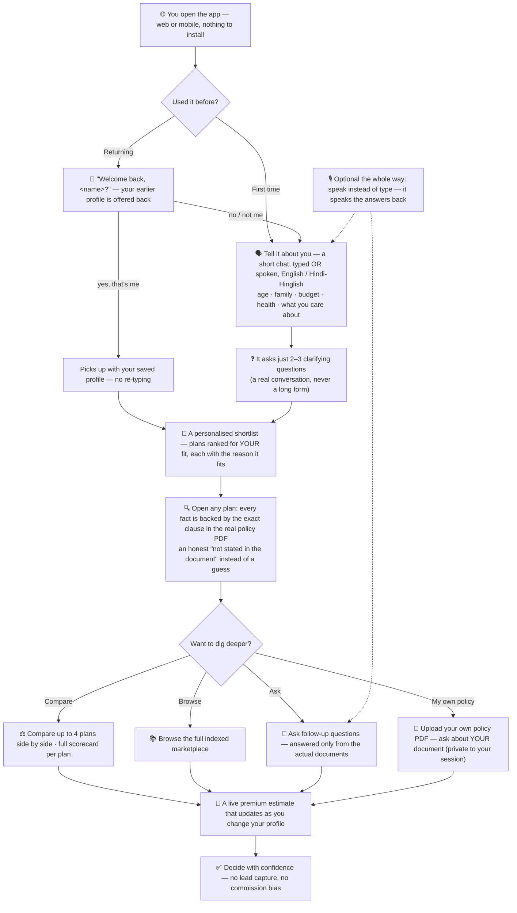
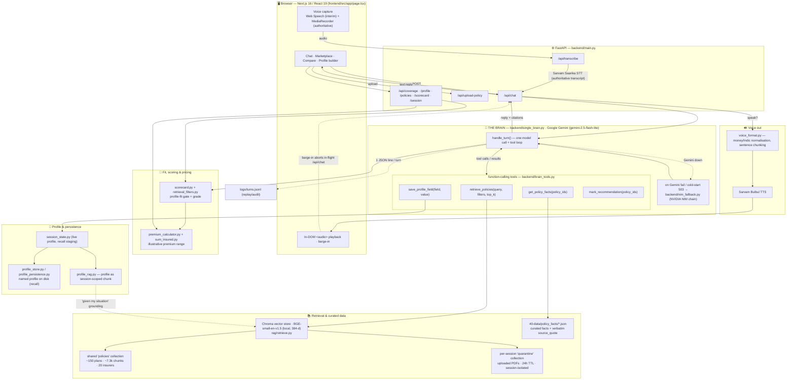
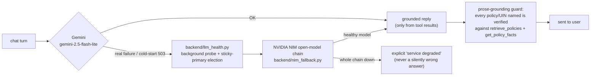
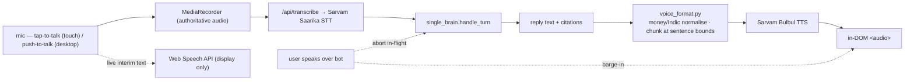
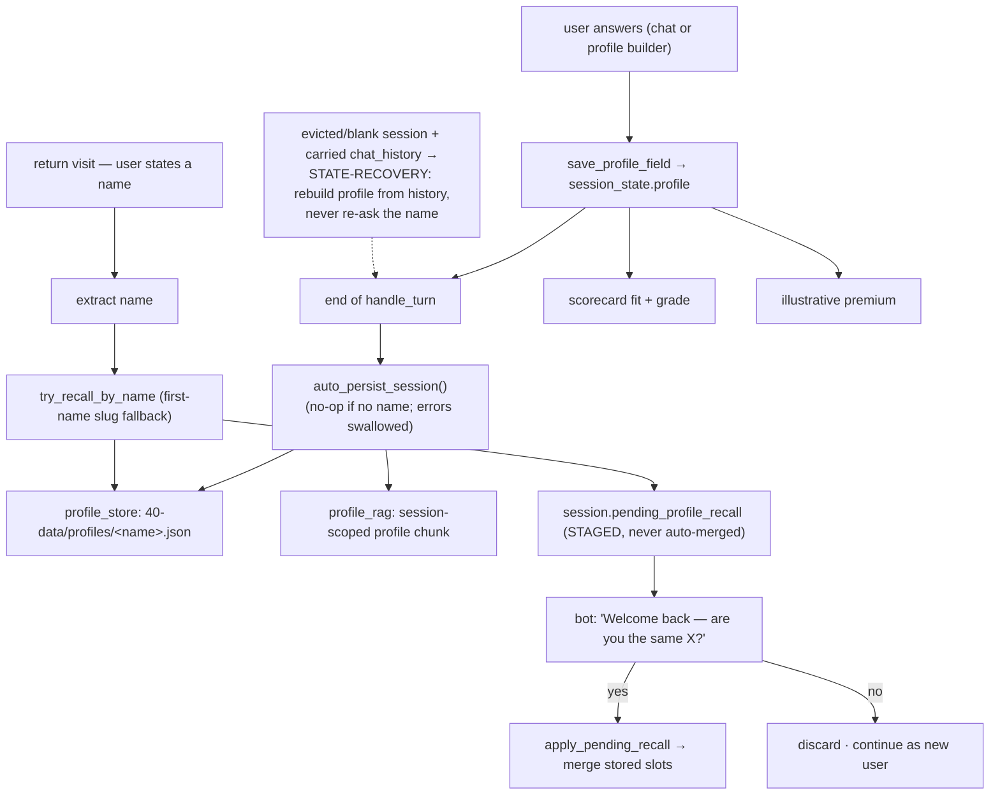
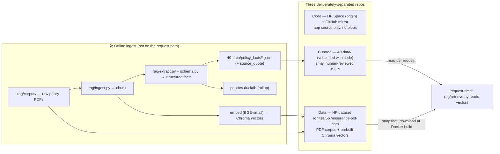
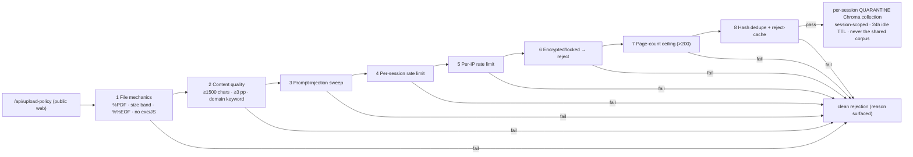
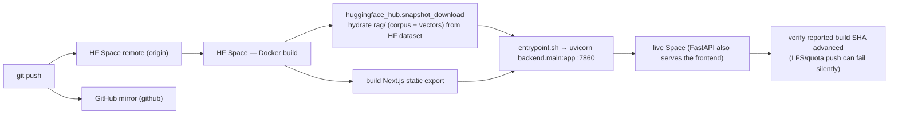

<!-- The YAML block above is Hugging Face Space configuration — it is parsed
     by HF to provision the Space (docker SDK, port 7860). Do not remove. -->

# Insurance Sales Portfolio Expert

A health-insurance advisory web app for the Indian market (presented in-app as
**"Insurance Advisor"**). You describe your situation in plain language (typed
or spoken, English or Hindi/Hinglish); it asks a few clarifying questions, then
recommends and explains real policies — grounded in the actual policy
documents, with every claim traceable to a source clause. It also lets you
upload your own policy PDF and ask questions about it.

Live: **https://rohitsar567-insurancebot.hf.space**

> **Reading this cold?** Sections 1–3 are plain English and need no technical
> background. Sections 4–10 are the full engineering detail (architecture,
> data, deployment) for a technical reviewer. Read straight through — each
> section only assumes the ones before it.

---

## Table of contents

1. [What this is](#1-what-this-is)
2. [The problem, and why it matters](#2-the-problem-and-why-it-matters)
3. [What it does](#3-what-it-does)
4. [How it works, end to end](#4-how-it-works-end-to-end)
5. [Data architecture](#5-data-architecture)
6. [Safety & quality](#6-safety--quality)
7. [Tech stack & key decisions](#7-tech-stack--key-decisions)
8. [Repository map](#8-repository-map)
9. [Run it locally](#9-run-it-locally)
10. [Deployment](#10-deployment)

---

## 1. What this is

Buying health insurance in India is hard for an ordinary person. There are
hundreds of plans across twenty-odd insurers, the important differences are
buried in 100-page policy wordings, and most online tools are lead-generation
funnels that push whatever pays the highest commission.

**This app is the opposite of that.** It behaves like a knowledgeable,
unbiased human advisor. You tell it about yourself — age, family, budget,
health, what you care about — and it walks you through plans that genuinely
fit, explains *why* in your words, and backs every factual statement with the
exact clause from the real policy document. There is no lead capture and no
commission bias. If the honest answer is "this isn't in the document," it says
so instead of guessing.

It works by chat or by voice, in English or Hindi/Hinglish, on desktop and
mobile.

---

## 2. The problem, and why it matters

A first-time buyer faces three concrete problems:

1. **Too much to compare.** ~150 health plans, each with dozens of
   decision-relevant fields (waiting periods, room-rent caps, co-pay,
   maternity, sub-limits, network size). No human reads them all.
2. **The truth is buried.** The number that decides whether a plan is right
   for you is on page 47 of a PDF written by lawyers.
3. **Most "advice" is conflicted.** Aggregator sites optimise for the sale,
   not the fit.

The cost of getting this wrong is real money and denied claims years later.
The goal is a tool a non-expert can trust the way they would trust a good
independent advisor: it personalises to *your* profile, it shows its sources,
and it never fabricates.

---

## 3. What it does

- **Conversational fact-find.** A short, natural back-and-forth establishes
  your profile (age, dependants, budget, pre-existing conditions, priorities)
  instead of a long form.
- **Personalised recommendations.** Plans are ranked for *fit to your
  profile* — a fixed-benefit plan is not recommended to someone who needs
  comprehensive cover; a plan whose entry age excludes you is filtered out.
- **Grounded answers.** Every factual claim about a policy is retrieved from
  that policy's actual document and shown with its source. Weak or missing
  evidence produces an honest "not stated in the document," never a guess.
- **Marketplace & compare.** Browse the full indexed catalogue, open a
  detailed scorecard per plan, and compare up to four side by side.
- **Profile → premium.** Your profile drives a live illustrative premium
  range; changing the profile updates the estimate.
- **Bring your own document.** Upload any policy PDF; it is safely indexed for
  the rest of your session so you can ask questions about *your* document.
- **Voice.** Speak instead of typing (tap-to-talk on mobile, push-to-talk on
  desktop); replies are spoken back. Indian-accent and Hinglish aware.

---

## 4. How it works, end to end

This is the full architecture. It is described here because the architecture
*is* the product — this README is the single source of truth for how the
system works today.

### 4.1 The user's journey (plain English — no tech)

Before the engineering detail, here is what actually happens for the
person using it. No code, no jargon — just the path from opening the app
to deciding with confidence.




### 4.2 The shape, in one paragraph

A **Next.js** browser app talks to a **FastAPI** backend. Every chat turn goes
to a **single LLM "brain"** (Google **Gemini**) that has been given a small set
of **function-calling tools** — most importantly a retrieval tool over a
**Chroma** vector store built from the real policy documents. The brain decides
when to retrieve, what to retrieve, and how to answer; it cannot state a policy
fact it did not retrieve. If Gemini is unavailable, the turn transparently
falls back to an **NVIDIA NIM** open-model chain. Voice in/out is handled by
**Sarvam** (Indian-language STT/TTS). Heavy data (PDF corpus + prebuilt
vectors) lives in a separate Hugging Face **dataset**, not in the code repo.

### 4.3 Architecture diagrams (every layer, every link)

> These render natively on GitHub. They are the authoritative visual map
> of the system; a compact plain-text version of the core path is kept
> after them as a fallback for non-Mermaid renderers.

**A · Single-turn request flow — end to end, all layers**



**B · LLM brain + fail-loud fallback chain**



**C · Voice pipeline (in / out, with barge-in)**



**D · Profile, personalisation & returning-user recall**



**E · Data architecture & offline ingest pipeline**



**F · Uploaded-PDF defence — 8 sequential gates**



**G · Deployment**



---

### 4.3-text Request flow (a single turn) — plain-text fallback

```
            ┌──────────────────────────────────────────────┐
            │  Browser — Next.js 16 / React 19 (page.tsx)  │
            │  chat · marketplace · compare · profile ·    │
            │  voice (Web Speech interim + MediaRecorder)  │
            └───────────────┬──────────────────────────────┘
              audio │ text  │  POST /api/*
                    ▼        ▼
            ┌──────────────────────────────────────────────┐
            │  FastAPI  (backend/main.py)                   │
            │  /api/transcribe  → Sarvam STT (authoritative)│
            │  /api/chat        → single_brain.handle_turn  │
            │  /api/upload-policy → 8 security gates → quar. │
            │  /api/coverage·/profile·/scorecard·/session   │
            └───────────────┬──────────────────────────────┘
                            ▼
            ┌──────────────────────────────────────────────┐
            │  THE BRAIN  (backend/single_brain.py)         │
            │  Google Gemini + function-calling tools       │
            │  tools (backend/brain_tools.py):              │
            │   • retrieve_policies(query, filters, top_k)  │
            │   • save_profile_field(...)                   │
            │   • get_policy_facts(policy_ids)              │
            │   • mark_recommendation(...)                  │
            │  └ on Gemini failure / first-turn 503 →       │
            │    backend/nim_fallback.py  (NIM chain,       │
            │    health-probed sticky-primary election)     │
            └───────────────┬──────────────────────────────┘
                            ▼
            ┌──────────────────────────────────────────────┐
            │  RETRIEVAL  (rag/retrieve.py)                 │
            │  Chroma vector store · BGE-small local 384-d  │
            │  • shared "policies" collection (~150 plans,  │
            │    ~7.3k chunks, 20 insurers)                 │
            │  • per-session "quarantine" collection for    │
            │    user-uploaded PDFs (24h TTL, isolated)     │
            └──────────────────────────────────────────────┘

  Reply (+ citations) → optional Sarvam TTS → played in-DOM in the browser.
  Every turn appends one JSON line to logs/turns.jsonl for replay/audit.
```

### 4.4 Why a single brain (not a multi-model pipeline)

Earlier designs split the work across several LLM passes (a separate
fact-find brain, a QA brain, a faithfulness-judge). That scaffolding was
removed: a single frontier model with well-designed tools is more accurate,
far simpler, and eliminates a whole class of cross-model contract bugs. Today
there is exactly **one** brain call per turn plus its tool calls. Faithfulness
is enforced structurally — the brain can only state what `retrieve_policies`
returned — rather than by a second grader model.

### 4.5 The fallback chain

The brain's primary is Gemini (`gemini-2.5-flash-lite`). On a real Gemini
failure or a cold-start 503, the turn falls back to an NVIDIA NIM chain of
open models. Candidate selection uses a background health probe with
sticky-primary election (`backend/llm_health.py`) so one healthy model is
chosen per call. The fallback is **fail-loud**: if the whole chain is down the
user gets an explicit "service degraded" message, never a silently wrong
answer. (A separate LLM "judge" existed historically and has been retired —
the single-brain design made it redundant.)

### 4.6 Voice

The browser shows a live interim transcript via the Web Speech API while
`MediaRecorder` captures the authoritative audio, which is sent to
`/api/transcribe` (**Sarvam Saarika** STT). Replies are synthesised by
**Sarvam Bulbul** TTS, with money/Indic shorthand normalised in
`backend/voice_format.py` before synthesis (long replies are chunked at
sentence boundaries so the full answer is spoken, not just the first
sentence), and played through an in-DOM `<audio>` element. Speaking over
the bot (barge-in) pauses that audio **and** aborts the in-flight
`/api/chat` request. On touch devices voice is tap-to-talk; on desktop,
push-to-talk (the hold-SPACE shortcut was removed); the live interim
transcript accumulates the full utterance while you speak.

### 4.7 Profile & personalisation

Your answers build a session profile (`backend/session_state.py`,
`profile_store.py`, `profile_persistence.py`). The profile is also embedded as
a session-scoped chunk (`backend/profile_rag.py`) so the brain can ground
"given my situation" references, with strict per-session isolation. The
profile drives both recommendation fit and the illustrative premium estimate
(`backend/premium_calculator.py`, `sum_insured.py`).

---

## 5. Data architecture

There are **three repositories**, deliberately separated:

*(You don't need any of this to use the app — just open the live link at
the top. This section is for someone running or reviewing the code.)*

The data is split into **three places**, each for a clear reason:

| # | Place | What it holds | Why it's separate |
| - | --- | --- | --- |
| 1 | **Code repo** (this repo — HF Space + GitHub mirror) | Application source only — no data blobs | Keeps the deployable image small (the Space has a tight size cap) |
| 2 | **Data dataset** (HF dataset `rohitsar567/insurance-bot-data`) | The big binaries: policy-PDF corpus + prebuilt Chroma vectors | Large files don't belong in code; pulled in automatically at build |
| 3 | **Curated facts** (`40-data/`, inside this code repo) | Small, human-reviewed JSON the backend reads on every request | Decision-critical and tiny — safe to version alongside the code |

What lives where:

- **`rag/corpus/`** — raw policy PDFs. Git-ignored; hydrated at Docker build
  from the data dataset via `huggingface_hub.snapshot_download`.
- **`rag/vectors/`** — persisted Chroma store (BGE-small-en-v1.5, local CPU,
  384-d). Git-ignored; from the data dataset.
- **`40-data/policy_facts/*.json`** — per-policy curated facts, each value
  carrying its verbatim `source_quote`. Powers the marketplace cards and
  scorecards.
- **`40-data/reviews/`, `premiums/`, `insurer_network.json`** — sourced
  insurer reviews, illustrative premium baselines, hospital-network counts.
- **`rag/ingest.py` / `extract.py` / `schema.py` / `policies.duckdb`** — the
  *offline* ingestion + structured-extraction pipeline (download → chunk →
  embed → extract). Not on the request hot path; used to (re)build the data
  dataset.

**Provenance rule:** every policy fact shown to a user traces to a real clause
in a real PDF. Where a document genuinely doesn't state something, it is
recorded as an honest sourced-null ("not stated in `<file>.pdf`"), never
invented or back-filled.

---

## 6. Safety & quality

### 6.1 Uploaded-PDF defence (8 gates)

`/api/upload-policy` accepts arbitrary PDFs from the public web — a real
attack surface. `backend/security.py` runs every upload through eight gates
before the file is ever embedded or shown to the model:

1. **File mechanics** — `%PDF` magic, 5 KB–25 MB size band, well-formed
   `%%EOF`, and a scan for embedded executables / JavaScript / launch actions.
2. **Content quality** — ≥1500 chars of extractable text, ≥3 pages, and at
   least one insurance-domain keyword (rejects scans, junk, off-topic docs).
3. **Prompt-injection** — regex sweep for "ignore previous instructions",
   "reveal your system prompt", jailbreak patterns, etc.
4. **Per-session rate limit** — caps uploads / chunk quota per session.
5. **Per-IP rate limit** — catches session-ID rotation.
6. **Encrypted/locked PDF** — rejected cleanly rather than stored opaque.
7. **Page-count ceiling** — >200 pages is an abuse/bundle vector.
8. **Hash dedupe + reject-cache** — identical re-uploads short-circuit.

Beyond identical-file dedup, a **UIN net-new check** runs on every upload:
if the PDF's IRDAI UIN already belongs to a catalogued policy, the upload
is recognised as *not* net-new and the caller is pointed at the existing
marketplace card instead of a duplicate being indexed.

Accepted uploads are embedded into a **separate, per-session quarantine**
Chroma collection (never the shared corpus), scoped by `session_id` so one
user's document is invisible to another, and auto-purged after a 24-hour idle
TTL.

### 6.2 Answer faithfulness

Faithfulness is structural, not bolt-on: the brain answers only from what
its tools returned — `retrieve_policies` (policy-wording chunks) and
`get_policy_facts` (claim-settlement ratio, complaints, scorecard and
insurer-review data) — must cite, and is instructed to refuse when that
grounding is weak. A prose-grounding guard verifies any policy / UIN named
in the reply against both tools' returned policies before it is sent.
Recommendation fit is gated (`backend/scorecard.py`,
`retrieval_filters.py`) so plans that structurally don't fit the user's stated
constraints are dropped, with the reason surfaced.

### 6.3 Evaluation

A gold Q&A harness lives at `eval/run.py`. **Status:** it is pending a re-port
to the single-brain architecture (it targeted the removed orchestrator) and is
intentionally hard-guarded from running so it cannot publish stale scores; see
its module docstring. The automated test suite (`tests/`, run with `pytest`)
is the current green gate and covers routing, scoring, premium, recall, the
upload security gates, and conversation logic.

### 6.4 Known limitations (honest)

These are real and stated up front rather than buried:

- **Uploaded-doc persistence is within-session, not across restarts.**
  Upload → graded marketplace card → grounded Q&A about the PDF all work
  live within a running container. But the Hugging Face Space's working
  filesystem is ephemeral by design (a fresh Chroma snapshot is pulled on
  every rebuild — see §10), and in practice an uploaded doc does **not**
  survive a Space rebuild/restart: the marketplace reverts to its
  curated/extracted baseline. Treat uploads as session-scoped. An
  operator/abuse prune endpoint exists (`POST /api/admin/uploaded-docs/
  prune`, password-gated) to remove a persisted upload by id or prefix.
- **Uploaded-PDF field extraction is deterministic-heuristic, not LLM.**
  A standard IRDAI-format wording yields a real (non-sentinel) grade; a
  scanned-image or non-standard PDF with little extractable text honestly
  shows the data-starved sentinel rather than a fabricated grade.
- **Live (BETA) voice mode** uses the browser's in-built speech
  recognition and is labelled unstable; **push-to-talk** is the reliable
  path (warm-armed mic + pre-roll so the first word is never clipped, and
  long answers are chunked so nothing is truncated).
- **Recommendation vs. factual lookup.** A factual question that names a
  specific policy is answerable on a cold session; broad "recommend me a
  plan" requests still require the short fact-find first (by design).

---

## 7. Tech stack & key decisions

| Layer | Choice | One-line why |
| --- | --- | --- |
| Frontend | Next.js 16 (App Router), React 19, Tailwind v4, static export | Production-pattern UI; static export serves straight from the Space |
| Backend | FastAPI + Pydantic | Async I/O, typed request/response, auto OpenAPI |
| Brain | Google Gemini (`gemini-2.5-flash-lite`) + function calling | Frontier free-tier quality; one model + tools beats a multi-pass pipeline |
| Fallback | NVIDIA NIM open-model chain, health-elected | Free, diverse; fail-loud, never silently wrong |
| Retrieval | Chroma + BGE-small-en-v1.5 (local, 384-d) | Embedded, no infra, free, offline embeddings |
| Voice | Sarvam Saarika (STT) + Bulbul (TTS) + Sarvam-M (Indic) | First-class Indian-accent / Hinglish handling |
| Hosting | Hugging Face Space (Docker) + companion HF dataset | Free, GitHub-mirrored; code/data split keeps the image small |

Decisions are deliberately biased toward *one deployable artifact, no
fabrication, fail loud*. The single-brain consolidation, the NIM-only fallback
(structured-output reliability over cross-provider breadth), the local
embeddings (zero rate limits, offline ingest) and the code/data repo split are
the load-bearing ones.

---

## 8. Repository map

**At a glance** — the root is intentionally small; you only need to know
these:

- **`backend/`** — FastAPI app + the brain, tools, retrieval, scoring, security
- **`frontend/`** — the Next.js web app
- **`rag/`** — retrieval + offline ingest (corpus/vectors are git-ignored, pulled at build)
- **`40-data/`** — curated, human-reviewed policy facts (versioned with code)
- **`tests/`** — the pytest green gate
- root files: `Dockerfile`, `entrypoint.sh`, `requirements.txt`, `pytest.ini`, `README.md`

<details>
<summary><b>Full directory tree</b> — click to expand</summary>

```
.
├── backend/                  FastAPI app
│   ├── main.py               HTTP routes (chat, transcribe, upload, profile, …)
│   ├── single_brain.py       THE brain — Gemini + function-calling tools
│   ├── brain_tools.py        the tools the brain can call (retrieval, profile, …)
│   ├── nim_fallback.py       NIM fallback when Gemini fails / cold-start 503
│   ├── llm_health.py         background probe + sticky-primary election
│   ├── security.py           the 8 upload-defence gates
│   ├── scorecard.py /        recommendation fit + scoring
│   │   retrieval_filters.py
│   ├── premium_calculator.py profile → illustrative premium
│   │   sum_insured.py
│   ├── session_state.py /    per-session profile + persistence
│   │   profile_store.py / profile_persistence.py / profile_rag.py
│   ├── voice_format.py       TTS pre-processing (money/Indic normalisation)
│   ├── admin.py              /api/admin/* (health, telemetry)
│   └── providers/            thin clients: google_gemini, nvidia_nim, sarvam_*,
│                             local_embeddings (BGE), openrouter/groq (dormant)
├── frontend/                 Next.js 16 app (src/app/page.tsx, src/lib/*)
├── rag/                      retrieval + offline ingest pipeline
│   ├── retrieve.py           query → top-k chunks (request hot path)
│   ├── ingest.py/extract.py/schema.py   offline corpus build
│   ├── corpus/ vectors/      data — git-ignored, from the HF dataset
│   └── policies.duckdb       offline structured rollup
├── 40-data/                  curated, version-with-code structured facts
│   ├── policy_facts/*.json   per-policy facts + verbatim source_quote
│   └── reviews/ premiums/ insurer_network.json
├── eval/                     gold Q&A harness (pending single-brain re-port)
├── 70-docs/                  design docs & ADRs  ⚠️ see note below
├── 80-audit/                 defect register / audit transcripts
├── tools/                    operational scripts (corpus, probes, link-rot)
├── tests/                    pytest suite — the green gate (`pytest`)
├── Dockerfile / entrypoint.sh   HF Space image (pulls the data dataset)
├── pytest.ini                scopes pytest to tests/ (clean on a fresh clone)
└── requirements.txt
```

</details>

> ⚠️ **Note on `70-docs/` and ADRs:** these capture design history and
> rationale; some predate the single-brain rewrite and are being brought into
> line with the system as it actually runs today. **This README is the
> authoritative present-state map**; the ADRs are decision context.

---

## 9. Run it locally

**Prerequisites:** Python 3.11+, Node 20+, the API keys below.

```bash
# 1. Code
git clone <code-repo-url> "Insurance Sales Bot"
cd "Insurance Sales Bot"
python -m venv .venv && . .venv/bin/activate
pip install -r requirements.txt

# 2. Data (corpus + prebuilt vectors live in the companion dataset)
python -c "from huggingface_hub import snapshot_download; \
  snapshot_download(repo_id='rohitsar567/insurance-bot-data', \
  repo_type='dataset', local_dir='rag/_hf_dataset_backup')"
#   then place rag/corpus and rag/vectors from the snapshot into rag/
#   (the Docker build does this automatically; see entrypoint.sh)

# 3. Secrets — copy the example and fill in:
cp .env.example .env
#   GOOGLE_API_KEY      — Gemini brain (primary)         [required]
#   NVIDIA_NIM_API_KEY  — NIM fallback chain             [required]
#   SARVAM_API_KEY      — STT / TTS / Indic              [required for voice]
#   HF_TOKEN            — pull the data dataset at boot  [required]
#   ADMIN_PASSWORD      — gates /api/admin/*             [required]
#   VOYAGE_API_KEY      — offline ingest embeddings only [ingest only]
#   OPENROUTER/GROQ_API_KEY — dormant (kept for one-flip re-enable)

# 4. Backend
uvicorn backend.main:app --host 127.0.0.1 --port 8000 --reload

# 5. Frontend (separate terminal)
cd frontend && npm install && npm run dev      # http://localhost:3000

# Tests (the green gate)
pytest                                          # collects tests/ only
```

---

## 10. Deployment

Hosting is a **Hugging Face Space** running the `Dockerfile`:

1. The image installs the backend and builds the static frontend.
2. At build time it runs `huggingface_hub.snapshot_download` to hydrate
   `rag/` (corpus + vectors) from the `rohitsar567/insurance-bot-data`
   dataset, so the Space repo itself stays code-only and small.
3. `entrypoint.sh` starts `uvicorn backend.main:app` on `$PORT` (default
   `7860`, the port HF Spaces routes to); FastAPI also serves the exported
   frontend.

The code repo is mirrored to **both** the HF Space remote (`origin`) and a
GitHub remote (`github`); the heavy data is updated on the HF **dataset**
side. Space repository secrets supply the API keys listed in §9. After any
deploy, verify the Space's reported build SHA actually advanced before
trusting that new code is live (a quota/LFS push can fail without surfacing
an error).
