<!-- The YAML block above is Hugging Face Space configuration — it is parsed
     by HF to provision the Space (docker SDK, port 7860). Do not remove. -->

# Insurance Sales Portfolio Expert

A health-insurance advisory web app for the Indian market (presented in-app as
**"Insurance Advisor"**). You describe your situation in plain language (typed
or spoken, English or Hindi/Hinglish); it asks a few clarifying questions, then
recommends and explains real policies — grounded in the actual policy
documents, with every claim traceable to a source clause. It also lets you
upload your own policy PDF and ask questions about it.

Live: **https://rohitsar567-insurancebot.hf.space**

> **Reading this cold?** §1 is plain English. §2 walks you down four levels of abstraction: the user journey (§2.1), the building blocks (§2.2), the functional abstraction inside each block (§2.3), then deep-dives per building block (§2.4–§2.9). §3 gives a function-by-function sequence-diagram view of the six most important jobs. §4–§8 are safety, stack, repo map, run-it-locally, and deployment.

---

## Table of contents

1. [What this is](#1-what-this-is)
2. [How it works, end to end](#2-how-it-works-end-to-end)
3. [Key functions in plain language](#3-key-functions-in-plain-language)
4. [Safety & quality](#4-safety--quality)
5. [Tech stack & key decisions](#5-tech-stack--key-decisions)
6. [Repository map](#6-repository-map)
7. [Run it locally](#7-run-it-locally)
8. [Deployment](#8-deployment)

---
## 1. What this is

**The short answer.** A health-insurance advisor that behaves like a
knowledgeable, unbiased human advisor — *not* a lead-generation funnel.
You describe your situation; it asks a few clarifying questions; it
recommends real plans that fit, with every factual claim backed by the
exact clause in the real policy document. No lead capture. No commission
bias. If the honest answer is *"this isn't in the document,"* it says so —
instead of guessing.

It works by chat or voice, in English or Hindi/Hinglish, on desktop and
mobile.

### The problem this solves

Buying health insurance in India is hard for an ordinary person. A
first-time buyer faces three concrete problems:

1. **Too much to compare.** ~150 plans across 20 insurers, each with
   dozens of decision-relevant fields (waiting periods, room-rent caps,
   co-pay, maternity, sub-limits, network size). No human reads them all.
2. **The truth is buried.** The number that decides whether a plan is
   right for *you* is on page 47 of a PDF written by lawyers.
3. **Most "advice" is conflicted.** Aggregator sites optimise for the
   sale, not the fit.

The cost of getting this wrong is real money and denied claims years
later. The goal is a tool a non-expert can trust the way they would trust
a good independent advisor: personalised to *their* profile, sourced, and
never fabricating.

### What it does, concretely

- **Conversational fact-find** — short natural back-and-forth establishes
  your profile (age, dependants, budget, pre-existing conditions,
  priorities) instead of a long form.
- **Personalised recommendations** — plans ranked for *fit to your
  profile*. A fixed-benefit plan is not pushed to someone who needs
  comprehensive cover; a plan whose entry age excludes you is filtered
  out.
- **Grounded answers** — every factual claim about a policy is retrieved
  from that policy's actual document and shown with its source. Weak or
  missing evidence produces an honest "not stated in the document."
- **Marketplace & compare** — browse the full indexed catalogue, open a
  detailed scorecard per plan, compare up to four side by side.
- **Profile → premium (illustrative)** — a live ballpark premium range
  that updates as you change your profile. *Not* real underwriting — a
  multivariate range from public rate-card combinations (see §3.3).
- **Bring your own document** — upload any policy PDF; it is safely
  indexed for the rest of your session so you can ask questions about
  *your* document.
- **Voice** — speak instead of typing (tap-to-talk on mobile,
  push-to-talk on desktop); replies are spoken back. Indian-accent and
  Hinglish aware.

---

## 2. How it works, end to end

**The short answer.** A Next.js browser app talks to a FastAPI backend.
Every chat turn goes to a **single LLM "brain"** (Google **Gemini**) with
a small set of **function-calling tools** — most importantly a retrieval
tool over a **Chroma** vector store built from the real policy documents.
The brain decides when to retrieve, what to retrieve, and how to answer;
it *cannot* state a policy fact it did not retrieve. If Gemini is
unavailable, the turn transparently falls back to an **NVIDIA NIM**
open-model chain. Voice in/out is handled by **Sarvam** (Indian-language
STT/TTS). Heavy data (PDF corpus + prebuilt vectors) lives in a separate
Hugging Face **dataset**, not the code repo.

The rest of this section walks you down four levels of abstraction:
§2.1 the user's journey (plain English, no tech); §2.2 the building
blocks at the highest level (the four canonical buckets); §2.3 the
functional abstraction — what happens inside each bucket; and §2.4–§2.9
the deep dives per building block. Every diagram is followed by a
≤50-word summary and a hierarchical *how it flows* breakdown.

### 2.1 The user's journey (plain English — no tech)

Before the engineering detail, here is what actually happens for the
person using it. No code, no jargon — just the path from opening the app
to deciding with confidence.

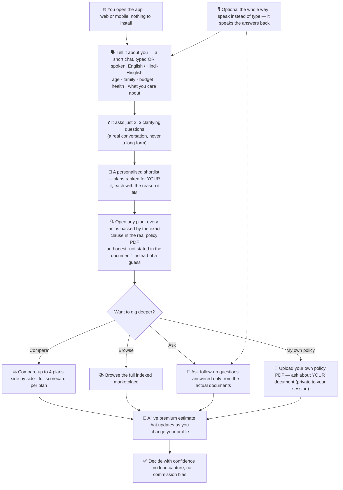

**Summary.** A user opens the app and ends the session having decided on
a plan with confidence — and how the system loops through compare /
browse / Q&A / upload along the way. No backend in this view; just the
human path. Every session starts fresh — there is no cross-session
memory; closing the tab forgets you (privacy-by-design, see ADR-043).

**How it flows:**

- **Conversational fact-find.** A short typed-or-spoken back-and-forth
  (English or Hindi-Hinglish) captures age, family, budget, health and
  what you care about — instead of a long form.
- **Personalised shortlist + a "why".** Plans are ranked for *your* fit;
  every fact about a plan is backed by the exact clause in the real
  policy PDF, never invented.
- **Branches from the shortlist.** Compare side by side, browse the full
  marketplace, ask follow-up questions, or upload your *own* policy PDF
  and ask about your document (kept private to your session).
- **Live premium.** Updates as you change the profile.
- **Decision.** No lead capture and no commission bias — the path ends at
  *decide*, not at a sales handoff.

### 2.2 System at a glance — the big building blocks

**The short answer.** The system has four "tall buckets":
**Frontend** (what you see), **Backend** (what runs on the server),
**Data layer** (the policy knowledge), and **Voice** (in and out). They
talk to each other over standard HTTP / JSON.

**Two terms first, in one sentence each:**

- **Frontend** = everything you see on screen — the chat box, marketplace
  cards, sliders, profile builder. Built with **Next.js + React** (a
  standard, well-supported web-UI library). Runs in your browser.
- **Backend** = everything that *runs on the server* — the LLM brain, the
  retrieval, the scoring/pricing logic, the upload-security gates. Built
  with **FastAPI** (a standard Python HTTP framework). Think of the
  frontend as the menu + waiter; the backend is the kitchen.

Both Next.js and FastAPI are deliberately boring, standard choices — they
let us not spend engineering on the UI layer or the HTTP plumbing, so we
spend that effort on the brain and the data, where the product
differentiation actually lives.

**Now the big picture — the buckets and how they talk:**

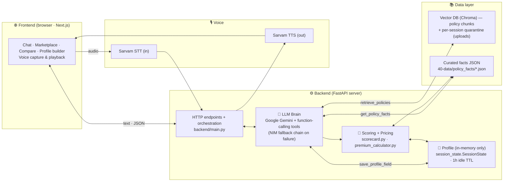

**Summary.** Four building blocks talk over HTTP / JSON: Frontend (the chat UI you see), Voice (Sarvam STT in + TTS out), Backend (FastAPI with four sub-blocks — orchestration, LLM Brain, Scoring + Pricing, Profile & Persistence), and the Data layer (Chroma vectors + curated JSON facts).

**How it flows:**

- **1. Frontend (browser · Next.js).** Renders chat, marketplace, compare, and the profile builder. Sends typed text and audio over HTTP, plays the synthesised reply.
- **2. Voice.** `Sarvam STT (in)` turns spoken audio into a text turn; `Sarvam TTS (out)` turns the reply text back into spoken audio.
- **3. Backend (FastAPI).** Four sub-blocks — **3a** HTTP endpoints + orchestration (`backend/main.py`); **3b** LLM Brain (Gemini + function-calling tools; NIM fallback on failure); **3c** Scoring + Pricing (`scorecard.py` + `premium_calculator.py`); **3d** Profile (in-memory only — `session_state.SessionState`, no disk).
- **4. Data layer.** Two stores — the Chroma **vector DB** (shared policy chunks + per-session quarantine for uploads) and curated **JSON facts** at `40-data/policy_facts/*.json`. The brain, scoring, and pricing all read from these.

**Diagram legend (used throughout §2):**


- **Solid arrow (`→`)** = a real call / data flow on the request path.
- **Double arrow (`⇄`)** = bidirectional — one side calls, the other returns.
- **Dotted arrow (`-.->`)** = a side-channel or async event — voice
  playback, barge-in interrupt, end-of-turn persistence, etc. — not on
  the main request path.
- **Subgraph box** = everything inside runs in one place (one process /
  one service / one storage layer).
- Edge labels (e.g. *"retrieve_policies"*) name the actual function or
  signal carried on that edge.


### 2.3 Functional abstraction — what happens inside each building block

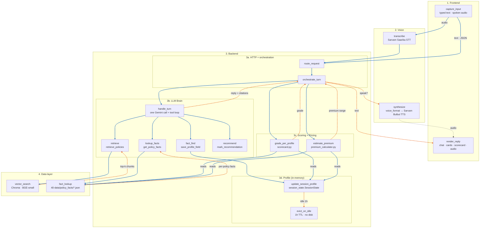

**Legend.** Blue solid = forward flow (input / call down the pipeline). Orange dashed = return flow (result / reply back up).

**Summary.** Inside each building block from §2.2, a small set of named functions fires per turn — Frontend captures and renders, Voice transcribes and synthesises, the four Backend sub-blocks orchestrate / decide / score / remember, and the Data layer answers their reads.

**How it flows:**

- **1. Frontend.** `capture_input` accepts typed text or recorded audio; `render_reply` paints chat + marketplace cards + scorecard + audio playback.
- **2. Voice.** `transcribe` is the inbound path (Sarvam Saarika STT); `synthesize` is the outbound path (`voice_format` normalises money / Indic shorthand → Sarvam Bulbul TTS).
- **3a. HTTP + orchestration.** `route_request` maps the URL to a handler; `orchestrate_turn` is the per-turn supervisor — it owns the request lifecycle and ties brain + scoring + voice + persistence together.
- **3b. LLM Brain.** One `handle_turn` per turn calls Gemini, which chooses which of `fact_find` / `retrieve` / `lookup_facts` / `recommend` to run as tools. The brain may only state what its tools returned.
- **3c. Scoring + Pricing.** `grade_per_profile` and `estimate_premium` read curated facts **and** the live profile, compute on every request (never stored), and hand back to `orchestrate_turn`.
- **3d. Profile (in-memory).** `update_session_profile` reflects each `fact_find` write into the live `SessionState.profile`. State lives in process memory only; an idle session is evicted after 1 h. There is no disk persistence and no cross-session recall (see ADR-043, 2026-05-27).
- **4. Data layer.** Two reads — `vector_search` for free-form Q&A, and `fact_lookup` for decision-critical numbers with verbatim quotes. The data layer does no writes during a request — those happen offline only (vector ingest, curated-facts edits).

### 2.4 LLM brain + fail-loud fallback chain

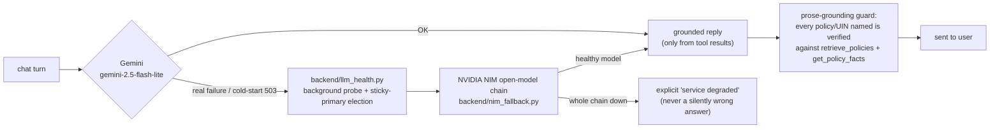

**Summary.** How a chat turn is served by the primary
LLM, what happens when it fails, and the structural guard that prevents a
silently wrong answer.

**How it flows:**

- **Primary path.** Gemini (`gemini-2.5-flash-lite`). On a healthy
  response → the reply is built *only* from what the tools returned.
- **Fallback path (fail-loud).** A real Gemini failure or a cold-start
  503 routes through `backend/llm_health.py` (a background probe with
  sticky-primary election) to the NVIDIA NIM open-model chain
  (`nim_fallback.py`). One healthy model in that chain serves the turn.
- **Last resort.** If the whole chain is down, the user gets an explicit
  *"service degraded"* message — never a silently wrong answer.
- **Prose-grounding guard.** Before a reply is sent, every policy / UIN
  named in the prose is verified against the same `retrieve_policies`
  and `get_policy_facts` results the brain saw (with an exemption for
  genuine catalogue UINs). Faithfulness is structural, not bolt-on.

**Why a single brain (not a multi-model pipeline).** Earlier designs split
the work across several LLM passes (a separate fact-find brain, a QA
brain, a faithfulness-judge). That scaffolding was removed: a single
frontier model with well-designed tools is more accurate, far simpler,
and eliminates a whole class of cross-model contract bugs. Today there is
exactly **one** brain call per turn plus its tool calls. Faithfulness is
enforced *structurally* — the brain can only state what `retrieve_policies`
and `get_policy_facts` returned — rather than by a second grader model.

**More on the fallback chain.** The brain's primary is Gemini
(`gemini-2.5-flash-lite`). On a real Gemini failure or a cold-start 503,
the turn falls back to an NVIDIA NIM chain of open models. Candidate
selection uses a background health probe with sticky-primary election
(`backend/llm_health.py`) so one healthy model is chosen per call. The
fallback is **fail-loud**: if the whole chain is down the user gets an
explicit *"service degraded"* message, never a silently wrong answer.
(A separate LLM "judge" existed historically and has been retired — the
single-brain design made it redundant.)

**Sticky-session retry policy (hardened 2026-05-27).** Once a session
has completed at least one successful single-brain turn, it stays on
single_brain for the rest of its lifetime — cross-fading to
`nim_fallback` mid-stream would discard `last_recommendation_ids /
last_retrieved_chunks / slug_to_insurer`. To absorb Gemini's
intermittent "high demand" 503 bursts on sticky sessions,
`_gemini_call` now uses an adaptive retry schedule: **non-sticky**
session keeps 1 retry with a 1.5 s backoff (fast-fail to NIM on
cold-start); **sticky** session gets 2 retries with jittered
exponential backoffs (1.5 s → 3 s, ±25 % jitter). If the chain still
fails after retries, the user sees a plain, honest reply *"My model
service had a brief blip on that turn — please send the same message
again."* (no more misleading *"could you say that again?"*).

### 2.5 Voice pipeline (in / out, with barge-in)

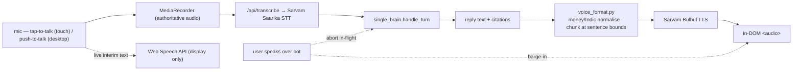

**Summary.** How spoken input becomes a chat turn, how
the reply becomes speech back, and how the user can interrupt mid-answer.

**How it flows:**

- **Capture.** Tap-to-talk (touch) or push-to-talk (desktop) starts
  `MediaRecorder` (the authoritative audio) and Web Speech (a live
  interim transcript shown on screen but never trusted for the turn).
- **STT.** The authoritative audio is sent to `/api/transcribe`
  (Sarvam Saarika — Indian-accent + Hinglish aware).
- **Brain → reply.** The transcript runs through `single_brain.handle_turn`
  exactly like a typed turn.
- **TTS.** `voice_format.py` normalises money / Indic shorthand and chunks
  at sentence bounds (so long replies are spoken in full); Sarvam Bulbul
  speaks; an in-DOM `<audio>` element plays.
- **Barge-in.** The user speaking over the bot pauses playback **and**
  aborts the in-flight `/api/chat`, so the bot stops mid-thought rather
  than over-talking.

**More on voice.** The browser shows a live *interim* transcript via the
Web Speech API while `MediaRecorder` captures the **authoritative** audio,
which is sent to `/api/transcribe` (**Sarvam Saarika** STT). Replies are
synthesised by **Sarvam Bulbul** TTS, with money / Indic shorthand
normalised in `backend/voice_format.py` before synthesis (long replies are
chunked at sentence boundaries so the full answer is spoken, not just the
first sentence), and played through an in-DOM `<audio>` element. Speaking
over the bot (**barge-in**) pauses that audio **and** aborts the in-flight
`/api/chat` request. On touch devices voice is tap-to-talk; on desktop,
push-to-talk; the live interim transcript accumulates the full utterance
while you speak.

### 2.6 Profile & personalisation (in-memory only)

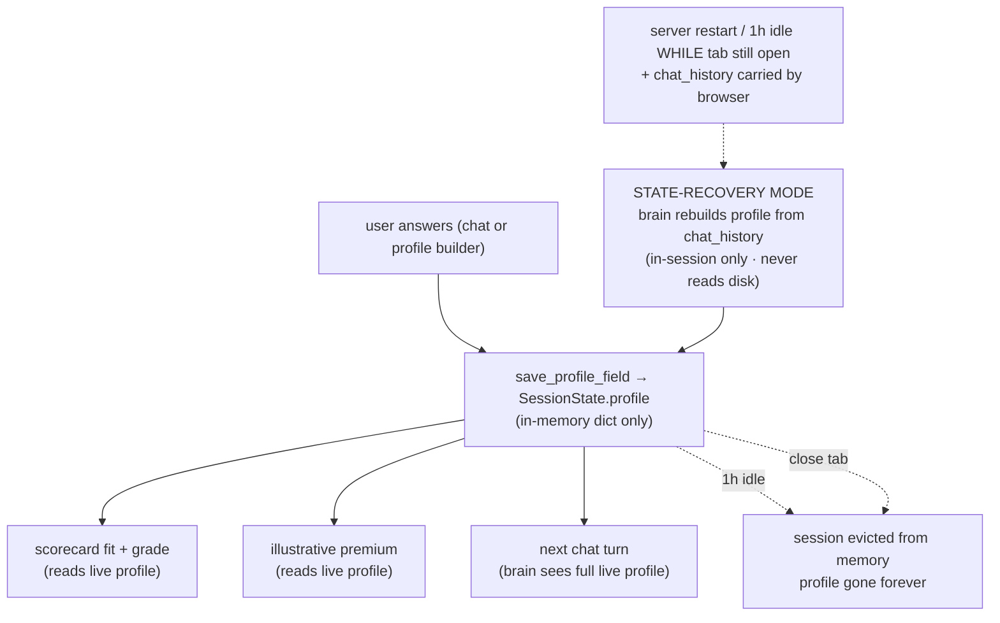

**Summary.** The profile is captured into a per-session in-memory dict
(`SessionState.profile`), feeds scoring + pricing + the next turn's
brain prompt, and is discarded the moment the session evicts (1 h idle
or "Clear chat"). There is no on-disk persistence and no cross-session
recall. The in-session **STATE-RECOVERY** path covers container
restarts by rebuilding the profile from the chat history the browser
still carries — it never touches disk.

**How it flows:**

- **Capture.** Every answer (chat or profile-builder form) is written via
  `save_profile_field` (or the `POST /api/profile` endpoint) into the
  live `SessionState.profile`. This is a regular Python dataclass field
  on the in-memory session object.
- **Drives scoring + pricing.** The same profile feeds the scorecard
  fit-and-grade (§3.2) and the live premium estimate (§3.3) on every
  request — both reads, never persisted.
- **Evicted on idle / close.** A session is evicted from the
  `_sessions` dict after 1 h of inactivity (`_TTL_SECONDS`). Hitting
  *Clear chat* (`POST /api/session/clear`) evicts immediately. Closing
  the tab disconnects the browser — the server-side session ages out on
  the same TTL.
- **State recovery (in-session only).** If the server restarted or the
  session evicted *while the browser still has the chat open*, the
  client re-sends its `chat_history` with the next turn. The brain
  enters **STATE-RECOVERY MODE** and silently re-captures the facts
  already stated in history — without ever asking the user's name
  again. This is **not** cross-session; it only resolves the case
  where the user is still in the same conversation.

**Why no cross-session recall (ADR-043, 2026-05-27).** An earlier
design persisted profiles to `40-data/profiles/<name>.json` and offered
a "Welcome back, <name>?" prompt on return. The name-only slug key
collided across distinct users (every "Rohit" wrote to the same file),
which required four sequential hardening passes — prompt redaction,
match-before-merge guards, same-turn fact extractors, a two-fact gate —
to keep contained. The cost/benefit for an insurance-shopping app
(rare-purchase, return sessions uncommon) didn't justify the surface.
The simpler "session is in-memory only" model matches the privacy story
the product wants to tell.

### 2.7 Data architecture — where the JSON lives, where the vectors live

**Summary.** Two complementary kinds of data power the bot: small JSON files of human-reviewed facts versioned with the code, and a Chroma vector database of the full policy text held in a separate HF dataset. JSON answers exact-number questions; vectors answer free-form Q&A.

#### 2.7.1 The two data kinds, side by side

| | **JSON files** | **Vector database (Chroma)** |
|---|---|---|
| **What's in it** | Per-policy curated structured fields — CSR%, ICR%, complaints/10k, room-rent rule, waiting periods, sub-limits, grade — **each value carries its verbatim `source_quote` from the PDF** | Full text of every policy PDF, chunked into ~500-token overlapping pieces, embedded as 384-d vectors with BGE-small-en-v1.5 |
| **File location** | `40-data/policy_facts/*.json` — inside the **code repo**, versioned in git | `rag/vectors/` — git-**ignored** on the laptop, lives in the **HF dataset** `rohitsar567/insurance-bot-data`, pulled at Docker build via `huggingface_hub.snapshot_download` |
| **Size** | ~150 files × few KB each — tiny, fits in git | ~7.3 k chunks × 384 dims + raw PDFs (hundreds of MB) — too big for git |
| **Built by** | Offline ingest (`rag/extract.py` + `schema.py`) — LLM-assisted extraction, **human-reviewed**, committed to git | Offline ingest (`rag/ingest.py`) — chunked + embedded once, published to HF dataset |
| **Read by (at request time)** | `get_policy_facts` tool (LLM brain) · `scorecard.py` · `premium_calculator.py` · marketplace-card renderer | `retrieve_policies` tool (LLM brain) — only |
| **Used for** | Decision-critical exact numbers cited on cards, in the scorecard, and in pricing — with the verbatim PDF quote shown | Free-form Q&A grounded in actual policy wording — *"what does this plan cover during pregnancy?"* |

#### 2.7.2 Other data files (smaller, supporting)

- **`40-data/reviews/`** — sourced insurer reviews (claims stories, regulator notes).
- **`40-data/premiums/`** — illustrative public rate-card combinations consumed by the multivariate premium estimator (§3.3).
- **`40-data/insurer_network.json`** — hospital-network counts per insurer.
_Pre-ADR-043 there was also a `40-data/profiles/<name>.json` directory of saved user profiles for cross-session recall. That mechanism was removed (see §2.6 — sessions are now in-memory only)._

All three remaining stores sit in the **code repo** (under `40-data/`) because they're small, human-reviewed, and decision-critical — safe to version alongside the code.

#### 2.7.3 Where each piece physically lives

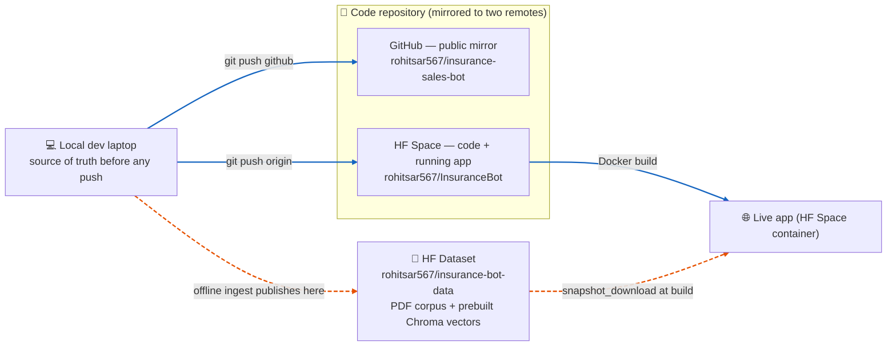

**Summary.** Three physical homes: the laptop (source of truth before any push), the code repo (mirrored to two git remotes — GitHub for reviewers and the HF Space's own repo for deployment), and the HF dataset (the heavy binaries).

**How it flows:**

- **Local laptop.** Single source of truth before any push. All editing happens here.
- **Code repo — two remotes.** `git push github` updates the GitHub public mirror (for reviewers). `git push origin` updates the HF Space's own repo and **triggers the Docker rebuild**.
- **HF dataset (offline channel).** Heavy binaries — PDF corpus + prebuilt Chroma vectors — are published here separately from the code so the deployable image stays small.
- **Live container.** On every Docker build, `huggingface_hub.snapshot_download` hydrates `rag/corpus/` and `rag/vectors/` from the HF dataset; the FastAPI app then has both data kinds available.

#### 2.7.4 Offline ingest pipeline (built once, not on the request path)

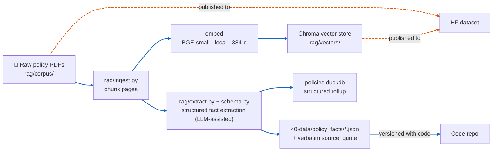

**Summary.** A single offline pipeline turns each raw PDF into two artefacts: chunked embeddings for free-form retrieval, and a structured JSON of decision-critical fields with verbatim quotes. Vectors → HF dataset; JSON → code repo.

**How it flows:**

- **Chunking + embedding.** `rag/ingest.py` splits each PDF into overlapping ~500-token chunks; BGE-small encodes each chunk into a 384-d vector; Chroma persists them to `rag/vectors/`.
- **Extraction.** `rag/extract.py` + `schema.py` run an LLM-assisted pass to pull structured fields (waiting periods, room-rent caps, CSR%, etc.) into a schema-validated JSON — **with the verbatim `source_quote` that justifies each value**.
- **Two destinations.** Vectors and raw PDFs are published to the HF dataset (too big for git); JSON files are versioned with the code so a reviewer can see exactly what facts feed the marketplace cards.
- **Why split.** Chunks power free-form Q&A; the JSON powers the marketplace cards, scoring, and pricing — two different queries, two different data shapes.

**Provenance rule.** Every policy fact shown to a user traces to a real clause in a real PDF. Where a document genuinely doesn't state something, it is recorded as a sourced-null (*"not stated in &lt;file&gt;.pdf"*) — never invented or back-filled.

### 2.8 Uploaded-PDF defence — 8 sequential gates

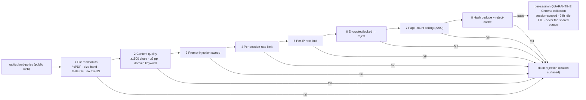

**Summary.** Every check a user-uploaded PDF passes
before its content is allowed to touch the vector store, and where rejected
files go.

**How it flows:**

- **The 8 gates, in order.** (1) **File mechanics** — `%PDF` magic, 5 KB–25 MB
  size band, well-formed `%%EOF`, no embedded executables / JavaScript /
  launch actions. (2) **Content quality** — ≥1500 extractable chars,
  ≥3 pages, at least one insurance-domain keyword. (3) **Prompt-injection
  sweep** — "ignore previous instructions", "reveal your system prompt",
  jailbreak patterns. (4) **Per-session rate limit.** (5) **Per-IP rate
  limit** (catches session-ID rotation). (6) **Encrypted/locked PDF** —
  rejected cleanly. (7) **Page-count ceiling** (>200 pages — an
  abuse/bundle vector). (8) **Hash dedupe + reject-cache** — identical
  re-uploads short-circuit.
- **Beyond identical-file dedup.** A **UIN net-new check** also runs — if
  the PDF's IRDAI UIN already belongs to a catalogued policy, the caller
  is pointed at the existing marketplace card instead of indexing a
  duplicate.
- **On pass.** Chunks land in a per-session **quarantine** Chroma
  collection — session-isolated, 24 h idle TTL — *never* the shared
  `policies` corpus.
- **On fail.** A clean rejection naming the gate; the file is deleted;
  nothing is embedded.

### 2.9 Deployment

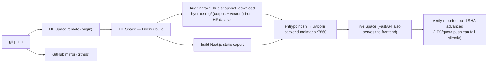

**Summary.** How a `git push` becomes a live Space, end
to end.

**How it flows:**

- **Two remotes.** `origin` = the Hugging Face Space (a push here
  triggers the Docker rebuild). `github` = the public mirror reviewers
  read.
- **Build.** The HF Space rebuilds the image, installs the backend,
  builds the Next.js static frontend, and runs
  `huggingface_hub.snapshot_download` to hydrate `rag/` (PDF corpus +
  prebuilt vectors) from the `insurance-bot-data` dataset — so the Space
  repo itself stays code-only and small.
- **Start.** `entrypoint.sh` launches `uvicorn backend.main:app` on
  `$PORT` (default 7860); FastAPI also serves the exported frontend.
- **Verify.** Always confirm the Space's reported build SHA actually
  advanced before trusting that new code is live — an LFS/quota push
  can fail without surfacing an error.

---

## 3. Key functions in plain language

**Summary.** Six internal jobs make the bot work. Each one gets a sequence diagram showing what calls what, a ≤50-word summary, and a step-by-step explanation. A seventh subsection makes explicit *what is stored vs what is live-only*.

### 3.1 Profile construction

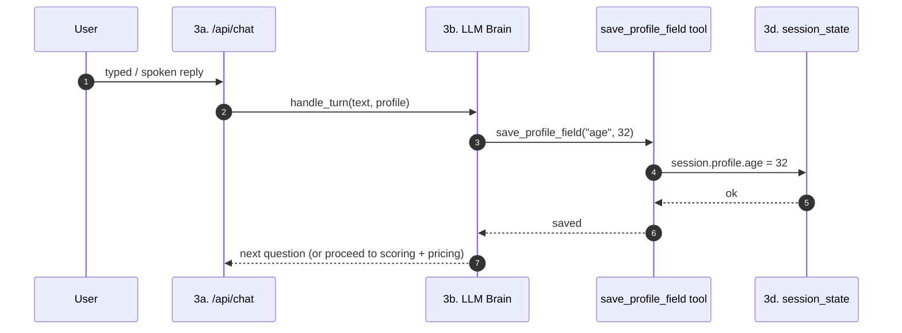

**Summary.** Every user reply runs the brain, which extracts one fact at a time and saves it via the `save_profile_field` tool into the live `session_state.profile`. No regex, no separate extractor model — extraction is a tool call.

**How it flows:**

- **User reply arrives** at `/api/chat` (typed text or post-STT transcript).
- **Brain runs.** `handle_turn` calls Gemini with the reply + the current profile + the tool schema.
- **Tool call.** When Gemini decides a fact is captured, it calls `save_profile_field(field, value)` — one call per fact.
- **Write.** The tool sets the field on `session.profile` (in memory). All fact-find captures are concentrated here; there is no second LLM pass.
- **Continue.** Brain returns the next question, or — if the profile is complete enough — proceeds to scoring + pricing.
- **Persistence is later.** End-of-turn, the whole profile is auto-persisted to disk by the orchestrator (see §3.6).

### 3.2 Profile-aware scoring

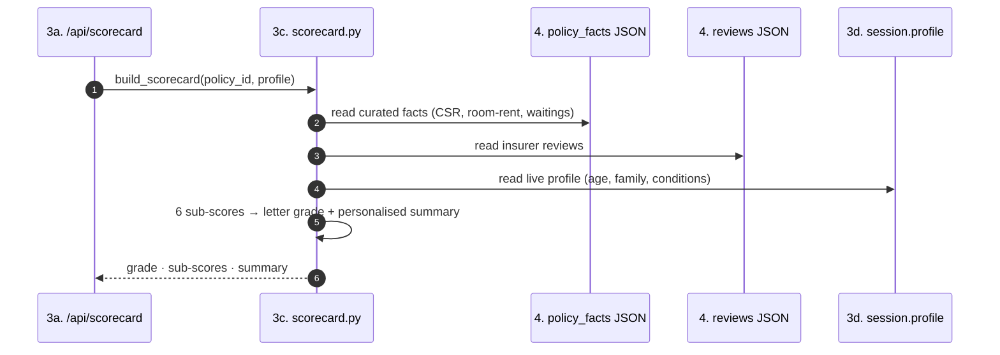

**Summary.** Scoring grades every policy *for this user* — same policy, two users, two grades. Six sub-scores roll up into a letter, with a personalised one-line summary naming the strengths for this profile and the one honest caveat.

**How it flows:**

- **Trigger.** Brain (or `/api/scorecard` directly) asks for a per-policy grade.
- **Three reads.** `scorecard.py` reads (a) the policy's `policy_facts` JSON, (b) the insurer's reviews JSON, and (c) the live profile from `session_state`.
- **Six sub-scores.** Coverage · predictability · claims · network · renewal · terms — each weighted against this profile (e.g. a smoker is penalised more in pricing predictability; an elder is penalised more in waiting-period structure).
- **Letter grade + summary.** A grade band (A–E) and a one-line summary listing this user's top strengths and the one capping caveat.
- **Live, not stored.** Recomputed per request. Storage would be wrong here — the grade depends on *who is asking*.

### 3.3 Profile-aware pricing — the multivariate ballpark

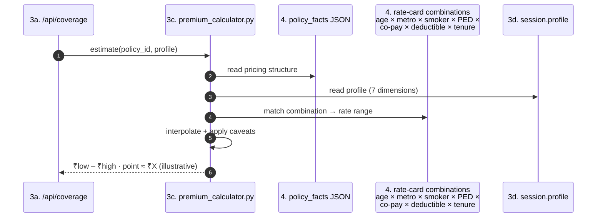

**Summary.** Pricing is a multivariate ballpark from public rate-card combinations — age × metro × smoker × PED × chosen co-pay × deductible × sum insured. Same plan, two users, two ranges. Explicitly **not** real underwriting.

**How it flows:**

- **Inputs.** The user's profile (seven dimensions) and the policy's pricing characteristics.
- **Multivariate match.** `premium_calculator.estimate` looks up combinations across the seven dimensions and interpolates within bands.
- **Output.** A range (e.g. ₹12 500 – ₹17 200 / yr) with a midpoint and a clear illustrative-only disclaimer.
- **Honest caveat.** Final premium depends on the insurer's underwriting + medicals + IRDAI-filed loadings — this is a directional ballpark, not a quote.
- **Live, not stored.** Same as scoring — recomputed per request because the answer is a function of *this* user.

### 3.4 Retrieval — `retrieve_policies` over the vector store

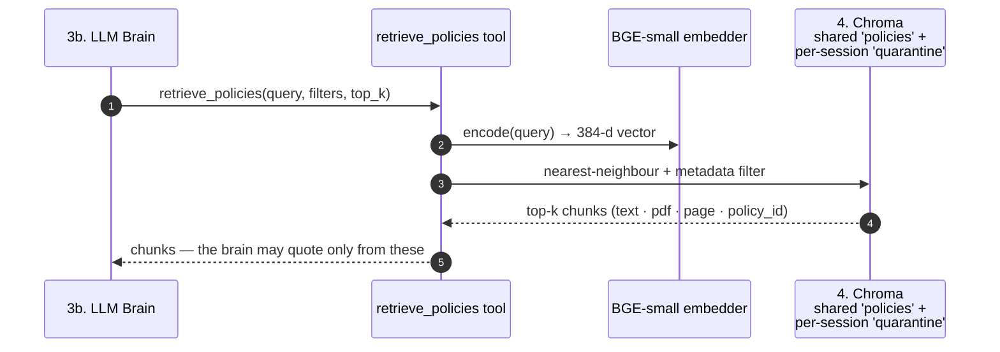

**Summary.** When the brain needs to *cite* policy wording, it asks the retrieval tool. The query is embedded with BGE-small, looked up in Chroma, and the top-k chunks come back with their source PDF, page, and policy_id. The brain may state nothing the tool did not return.

**How it flows:**

- **Query.** Brain composes a query from the user's question + the profile.
- **Embed.** Local BGE-small turns the query into a 384-d vector (no API hop, no rate limit).
- **Search.** Chroma returns nearest chunks, scoped to either the shared `policies` collection (catalogue) or the per-session `quarantine` collection (user-uploaded PDFs — never crosses sessions, 24 h TTL).
- **Faithfulness.** The brain may *only* state what these chunks (or `get_policy_facts`) returned. Anything else is a violation of the structural grounding guard (§2.4).

### 3.5 Curated facts — `get_policy_facts` (no embedding hop)

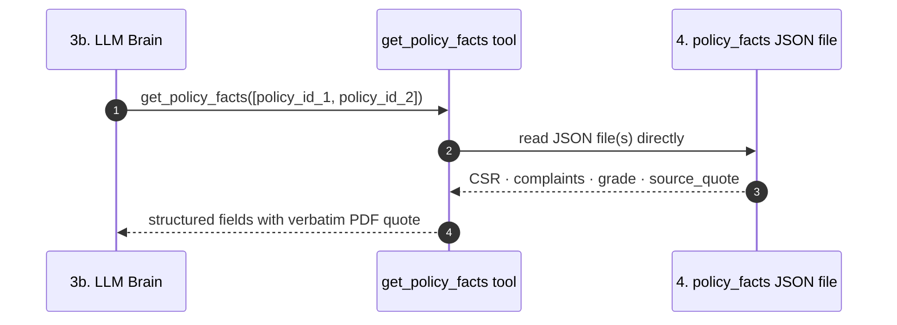

**Summary.** For decision-critical numbers (claim-settlement ratio, complaints volume, waiting periods, room-rent rule, grade), the brain calls `get_policy_facts` which reads the curated JSON directly — no embedding hop, no LLM, exact values with the verbatim PDF quote.

**How it flows:**

- **Why this exists alongside §3.4.** Retrieval is for free-form text Q&A; this is for exact, fast, source-cited number lookups. Different query shape, different mechanism.
- **No LLM in the path.** A plain file read of `40-data/policy_facts/<id>.json`. The brain quotes the value (and the `source_quote`) verbatim.
- **Used by more than the brain.** `scorecard.py` and `premium_calculator.py` also read these JSON files directly — see §2.3 (the brain's edge is not the only edge into the JSON).

### 3.6 In-session state recovery (server restart resilience)

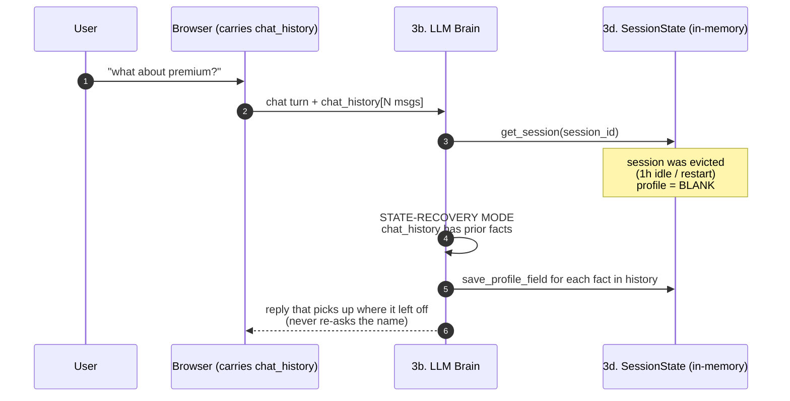

**Summary.** Sessions are in-memory only (`_TTL_SECONDS = 1h`), so a
container restart or long idle wipes the server-side profile. When the
browser still carries the conversation, the brain silently rebuilds the
profile from the chat history instead of starting over. No disk read,
no cross-session memory — purely a same-conversation resilience path.

**How it flows:**

- **Detect.** `get_session()` returns a blank `SessionState`, but `chat_history` arrives with ≥2 messages including a prior user turn → state was lost, not "fresh user".
- **Re-capture from history.** A high-priority **STATE-RECOVERY MODE** prompt block tells the LLM: do not say you lost anything, do not re-ask the name, instead call `save_profile_field` for every fact present in the conversation so far, then continue.
- **Resume.** From the LLM's point of view the next reply is just the next turn in an ongoing chat — the user never perceives the eviction.

(There is no cross-session recall — see §2.6 and ADR-043 for why that
was removed.)

### 3.7 What is stored vs what is live-only

| What | Where | Why |
|---|---|---|
| Policy PDFs + vector chunks | `rag/corpus/` + Chroma store (HF dataset → pulled at build) | Built once, offline; read every request |
| Curated policy facts (per policy) | `40-data/policy_facts/*.json` (code repo) | Small, human-reviewed, versioned with code |
| User profile (current session) | **In-memory only — `SessionState.profile` (1 h idle TTL, no disk)** | Closing the tab / clearing chat forgets the profile by design (ADR-043) |
| Per-policy **grade / scorecard** | **Not stored — live per request** | Two users get two grades for the same policy (profile-aware) |
| **Premium range** for a policy | **Not stored — live per request** | Same reason as the grade |
| Uploaded PDFs | Per-session Chroma quarantine, **24 h TTL** | Isolated to the uploader, never the shared corpus |
| Per-turn reasoning | `logs/turns.jsonl` (one JSON line per turn) | Replay / audit; never echoed to other users |

## 4. Safety & quality

### 4.1 Uploaded-PDF defence (8 gates)

`/api/upload-policy` accepts arbitrary PDFs from the public web — a real
attack surface. `backend/security.py` runs every upload through eight gates
before the file is ever embedded or shown to the model:

1. **File mechanics** — `%PDF` magic, 5 KB–25 MB size band, well-formed
   `%%EOF`, and a scan for embedded executables / JavaScript / launch actions.
2. **Content quality** — ≥1500 chars of extractable text, ≥3 pages, and at
   least one insurance-domain keyword (rejects scans, junk, off-topic docs).
3. **Prompt-injection** — regex sweep for "ignore previous instructions",
   "reveal your system prompt", jailbreak patterns, etc.
4. **Per-session rate limit** — caps uploads / chunk quota per session.
5. **Per-IP rate limit** — catches session-ID rotation.
6. **Encrypted/locked PDF** — rejected cleanly rather than stored opaque.
7. **Page-count ceiling** — >200 pages is an abuse/bundle vector.
8. **Hash dedupe + reject-cache** — identical re-uploads short-circuit.

Beyond identical-file dedup, a **UIN net-new check** runs on every upload:
if the PDF's IRDAI UIN already belongs to a catalogued policy, the upload
is recognised as *not* net-new and the caller is pointed at the existing
marketplace card instead of a duplicate being indexed.

Accepted uploads are embedded into a **separate, per-session quarantine**
Chroma collection (never the shared corpus), scoped by `session_id` so one
user's document is invisible to another, and auto-purged after a 24-hour idle
TTL.

### 4.2 Answer faithfulness

Faithfulness is structural, not bolt-on: the brain answers only from what
its tools returned — `retrieve_policies` (policy-wording chunks) and
`get_policy_facts` (claim-settlement ratio, complaints, scorecard and
insurer-review data) — must cite, and is instructed to refuse when that
grounding is weak. A prose-grounding guard verifies any policy / UIN named
in the reply against both tools' returned policies before it is sent.
Recommendation fit is gated (`backend/scorecard.py`,
`retrieval_filters.py`) so plans that structurally don't fit the user's stated
constraints are dropped, with the reason surfaced.

### 4.3 Evaluation

A gold Q&A harness lives at `eval/run.py`. **Status:** it is pending a re-port
to the single-brain architecture (it targeted the removed orchestrator) and is
intentionally hard-guarded from running so it cannot publish stale scores; see
its module docstring. The automated test suite (`tests/`, run with `pytest`)
is the current green gate and covers routing, scoring, premium, recall, the
upload security gates, and conversation logic.

### 4.4 Known limitations (honest)

These are real and stated up front rather than buried:

- **Uploaded-doc persistence is within-session, not across restarts.**
  Upload → graded marketplace card → grounded Q&A about the PDF all work
  live within a running container. But the Hugging Face Space's working
  filesystem is ephemeral by design (a fresh Chroma snapshot is pulled on
  every rebuild — see §2.7), and in practice an uploaded doc does **not**
  survive a Space rebuild/restart: the marketplace reverts to its
  curated/extracted baseline. Treat uploads as session-scoped. An
  operator/abuse prune endpoint exists (`POST /api/admin/uploaded-docs/
  prune`, password-gated) to remove a persisted upload by id or prefix.
- **Uploaded-PDF field extraction is deterministic-heuristic, not LLM.**
  A standard IRDAI-format wording yields a real (non-sentinel) grade; a
  scanned-image or non-standard PDF with little extractable text honestly
  shows the data-starved sentinel rather than a fabricated grade.
- **Live (BETA) voice mode** uses the browser's in-built speech
  recognition and is labelled unstable; **push-to-talk** is the reliable
  path (warm-armed mic + pre-roll so the first word is never clipped, and
  long answers are chunked so nothing is truncated).
- **Recommendation vs. factual lookup.** A factual question that names a
  specific policy is answerable on a cold session; broad "recommend me a
  plan" requests still require the short fact-find first (by design).
- **Admin LLM Chain — manual *Refresh now* and 30 s auto-poll
  (hardened 2026-05-27).** `POST /api/admin/probe` runs a real
  serial probe of every candidate model and updates `tested_at` on each
  `ModelHealth` row; the admin UI's `Refresh now` button and the LLM
  Chain tab's 30 s poll now both re-fetch `/api/admin/health` and call
  `renderUpdatedLabel()` so the top-left *"Last refresh / Next in"*
  timer reflects the actual just-completed probe (previously it stayed
  frozen at the login-time snapshot, so the operator could not tell
  from the timer whether probing had actually happened).

---

## 5. Tech stack & key decisions

| Layer | Choice | One-line why |
| --- | --- | --- |
| Frontend | Next.js 16 (App Router), React 19, Tailwind v4, static export | Production-pattern UI; static export serves straight from the Space |
| Backend | FastAPI + Pydantic | Async I/O, typed request/response, auto OpenAPI |
| Brain | Google Gemini (`gemini-2.5-flash-lite`) + function calling | Frontier free-tier quality; one model + tools beats a multi-pass pipeline |
| Fallback | NVIDIA NIM open-model chain, health-elected | Free, diverse; fail-loud, never silently wrong |
| Retrieval | Chroma + BGE-small-en-v1.5 (local, 384-d) | Embedded, no infra, free, offline embeddings |
| Voice | Sarvam Saarika (STT) + Bulbul (TTS) + Sarvam-M (Indic) | First-class Indian-accent / Hinglish handling |
| Hosting | Hugging Face Space (Docker) + companion HF dataset | Free, GitHub-mirrored; code/data split keeps the image small |

Decisions are deliberately biased toward *one deployable artifact, no
fabrication, fail loud*. The single-brain consolidation, the NIM-only fallback
(structured-output reliability over cross-provider breadth), the local
embeddings (zero rate limits, offline ingest) and the code/data repo split are
the load-bearing ones.

---

## 6. Repository map

**At a glance** — the root is intentionally small; you only need to know
these:

- **`backend/`** — FastAPI app + the brain, tools, retrieval, scoring, security
- **`frontend/`** — the Next.js web app
- **`rag/`** — retrieval + offline ingest (corpus/vectors are git-ignored, pulled at build)
- **`40-data/`** — curated, human-reviewed policy facts (versioned with code)
- **`tests/`** — the pytest green gate
- root files: `Dockerfile`, `entrypoint.sh`, `requirements.txt`, `pytest.ini`, `README.md`

<details>
<summary><b>Full directory tree</b> — click to expand</summary>

```
.
├── backend/                  FastAPI app
│   ├── main.py               HTTP routes (chat, transcribe, upload, profile, …)
│   ├── single_brain.py       THE brain — Gemini + function-calling tools
│   ├── brain_tools.py        the tools the brain can call (retrieval, profile, …)
│   ├── nim_fallback.py       NIM fallback when Gemini fails / cold-start 503
│   ├── llm_health.py         background probe + sticky-primary election
│   ├── security.py           the 8 upload-defence gates
│   ├── scorecard.py /        recommendation fit + scoring
│   │   retrieval_filters.py
│   ├── premium_calculator.py profile → illustrative premium
│   │   sum_insured.py
│   ├── session_state.py      per-session profile (in-memory only, ADR-043)
│   ├── voice_format.py       TTS pre-processing (money/Indic normalisation)
│   ├── admin.py              /api/admin/* (health, telemetry)
│   └── providers/            thin clients: google_gemini, nvidia_nim, sarvam_*,
│                             local_embeddings (BGE), openrouter/groq (dormant)
├── frontend/                 Next.js 16 app (src/app/page.tsx, src/lib/*)
├── rag/                      retrieval + offline ingest pipeline
│   ├── retrieve.py           query → top-k chunks (request hot path)
│   ├── ingest.py/extract.py/schema.py   offline corpus build
│   ├── corpus/ vectors/      data — git-ignored, from the HF dataset
│   └── policies.duckdb       offline structured rollup
├── 40-data/                  curated, version-with-code structured facts
│   ├── policy_facts/*.json   per-policy facts + verbatim source_quote
│   └── reviews/ premiums/ insurer_network.json
├── eval/                     gold Q&A harness (pending single-brain re-port)
├── 70-docs/                  design docs & ADRs  ⚠️ see note below
├── 80-audit/                 defect register / audit transcripts
├── tools/                    operational scripts (corpus, probes, link-rot)
├── tests/                    pytest suite — the green gate (`pytest`)
├── Dockerfile / entrypoint.sh   HF Space image (pulls the data dataset)
├── pytest.ini                scopes pytest to tests/ (clean on a fresh clone)
└── requirements.txt
```

</details>

> ⚠️ **Note on `70-docs/` and ADRs:** these capture design history and
> rationale; some predate the single-brain rewrite and are being brought into
> line with the system as it actually runs today. **This README is the
> authoritative present-state map**; the ADRs are decision context.

---

## 7. Run it locally

**Prerequisites:** Python 3.11+, Node 20+, the API keys below.

```bash
# 1. Code
git clone <code-repo-url> "Insurance Sales Bot"
cd "Insurance Sales Bot"
python -m venv .venv && . .venv/bin/activate
pip install -r requirements.txt

# 2. Data (corpus + prebuilt vectors live in the companion dataset)
python -c "from huggingface_hub import snapshot_download; \
  snapshot_download(repo_id='rohitsar567/insurance-bot-data', \
  repo_type='dataset', local_dir='rag/_hf_dataset_backup')"
#   then place rag/corpus and rag/vectors from the snapshot into rag/
#   (the Docker build does this automatically; see entrypoint.sh)

# 3. Secrets — copy the example and fill in:
cp .env.example .env
#   GOOGLE_API_KEY      — Gemini brain (primary)         [required]
#   NVIDIA_NIM_API_KEY  — NIM fallback chain             [required]
#   SARVAM_API_KEY      — STT / TTS / Indic              [required for voice]
#   HF_TOKEN            — pull the data dataset at boot  [required]
#   ADMIN_PASSWORD      — gates /api/admin/*             [required]
#   VOYAGE_API_KEY      — offline ingest embeddings only [ingest only]
#   OPENROUTER/GROQ_API_KEY — dormant (kept for one-flip re-enable)

# 4. Backend
uvicorn backend.main:app --host 127.0.0.1 --port 8000 --reload

# 5. Frontend (separate terminal)
cd frontend && npm install && npm run dev      # http://localhost:3000

# Tests (the green gate)
pytest                                          # collects tests/ only
```

---

## 8. Deployment

Hosting is a **Hugging Face Space** running the `Dockerfile`:

1. The image installs the backend and builds the static frontend.
2. At build time it runs `huggingface_hub.snapshot_download` to hydrate
   `rag/` (corpus + vectors) from the `rohitsar567/insurance-bot-data`
   dataset, so the Space repo itself stays code-only and small.
3. `entrypoint.sh` starts `uvicorn backend.main:app` on `$PORT` (default
   `7860`, the port HF Spaces routes to); FastAPI also serves the exported
   frontend.

The code repo is mirrored to **both** the HF Space remote (`origin`) and a
GitHub remote (`github`); the heavy data is updated on the HF **dataset**
side. Space repository secrets supply the API keys listed in §7. After any
deploy, verify the Space's reported build SHA actually advanced before
trusting that new code is live (a quota/LFS push can fail without surfacing
an error).
