<!-- The YAML block above is Hugging Face Space configuration — it is parsed
     by HF to provision the Space (docker SDK, port 7860). Do not remove. -->

# Insurance Sales Portfolio Expert

A health-insurance advisory web app for the Indian market (presented in-app as
**"Insurance Advisor"**). You describe your situation in plain language (typed
or spoken, English or Hindi/Hinglish); it asks a few clarifying questions, then
recommends and explains real policies — grounded in the actual policy
documents, with every claim traceable to a source clause. It also lets you
upload your own policy PDF and ask questions about it.

Live: **https://rohitsar567-insurancebot.hf.space**

> **Reading this cold?** §1 is plain English. §2 walks you from a user-flow
> diagram through the full architecture (each diagram followed by a plain
> explanation). §3 explains every key function in layman terms. §4–§9 are
> data, safety, stack, repo map, run-it-locally, and deployment.

---

## Table of contents

1. [What this is](#1-what-this-is)
2. [How it works, end to end](#2-how-it-works-end-to-end)
3. [Key functions in plain language](#3-key-functions-in-plain-language)
4. [Data architecture](#4-data-architecture)
5. [Safety & quality](#5-safety--quality)
6. [Tech stack & key decisions](#6-tech-stack--key-decisions)
7. [Repository map](#7-repository-map)
8. [Run it locally](#8-run-it-locally)
9. [Deployment](#9-deployment)

---
## 1. What this is

**The short answer.** A health-insurance advisor that behaves like a
knowledgeable, unbiased human advisor — *not* a lead-generation funnel.
You describe your situation; it asks a few clarifying questions; it
recommends real plans that fit, with every factual claim backed by the
exact clause in the real policy document. No lead capture. No commission
bias. If the honest answer is *"this isn't in the document,"* it says so —
instead of guessing.

It works by chat or voice, in English or Hindi/Hinglish, on desktop and
mobile.

### The problem this solves

Buying health insurance in India is hard for an ordinary person. A
first-time buyer faces three concrete problems:

1. **Too much to compare.** ~150 plans across 20 insurers, each with
   dozens of decision-relevant fields (waiting periods, room-rent caps,
   co-pay, maternity, sub-limits, network size). No human reads them all.
2. **The truth is buried.** The number that decides whether a plan is
   right for *you* is on page 47 of a PDF written by lawyers.
3. **Most "advice" is conflicted.** Aggregator sites optimise for the
   sale, not the fit.

The cost of getting this wrong is real money and denied claims years
later. The goal is a tool a non-expert can trust the way they would trust
a good independent advisor: personalised to *their* profile, sourced, and
never fabricating.

### What it does, concretely

- **Conversational fact-find** — short natural back-and-forth establishes
  your profile (age, dependants, budget, pre-existing conditions,
  priorities) instead of a long form.
- **Personalised recommendations** — plans ranked for *fit to your
  profile*. A fixed-benefit plan is not pushed to someone who needs
  comprehensive cover; a plan whose entry age excludes you is filtered
  out.
- **Grounded answers** — every factual claim about a policy is retrieved
  from that policy's actual document and shown with its source. Weak or
  missing evidence produces an honest "not stated in the document."
- **Marketplace & compare** — browse the full indexed catalogue, open a
  detailed scorecard per plan, compare up to four side by side.
- **Profile → premium (illustrative)** — a live ballpark premium range
  that updates as you change your profile. *Not* real underwriting — a
  multivariate range from public rate-card combinations (see §3.3).
- **Bring your own document** — upload any policy PDF; it is safely
  indexed for the rest of your session so you can ask questions about
  *your* document.
- **Voice** — speak instead of typing (tap-to-talk on mobile,
  push-to-talk on desktop); replies are spoken back. Indian-accent and
  Hinglish aware.

---

## 2. How it works, end to end

**The short answer.** A Next.js browser app talks to a FastAPI backend.
Every chat turn goes to a **single LLM "brain"** (Google **Gemini**) with
a small set of **function-calling tools** — most importantly a retrieval
tool over a **Chroma** vector store built from the real policy documents.
The brain decides when to retrieve, what to retrieve, and how to answer;
it *cannot* state a policy fact it did not retrieve. If Gemini is
unavailable, the turn transparently falls back to an **NVIDIA NIM**
open-model chain. Voice in/out is handled by **Sarvam** (Indian-language
STT/TTS). Heavy data (PDF corpus + prebuilt vectors) lives in a separate
Hugging Face **dataset**, not the code repo.

The rest of this section walks you through that, **plain-English first**
(§2.1 user flow, §2.2 system at a glance), then the **deep architecture
per subsystem** (§2.3 onwards). Every diagram is followed by an
explanation of what it shows and what each block / edge means.

### 2.1 The user's journey (plain English — no tech)

Before the engineering detail, here is what actually happens for the
person using it. No code, no jargon — just the path from opening the app
to deciding with confidence.

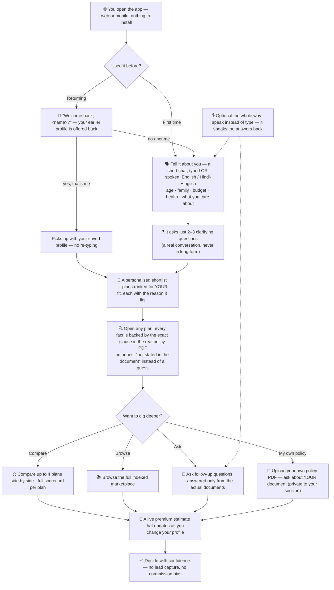

**What this diagram traces.** A first-time user opens the app and ends the
session having decided on a plan with confidence — and how the system loops
through compare / browse / Q&A / upload along the way. No backend in this
view; just the human path.

- **Returning-user check up front.** If the app recognises your name from
  before, it offers to restore your saved profile (so you never re-type);
  *no* takes you down the same path as a first-time user.
- **Conversational fact-find.** A short typed-or-spoken back-and-forth
  (English or Hindi-Hinglish) captures age, family, budget, health and
  what you care about — instead of a long form.
- **Personalised shortlist + a "why".** Plans are ranked for *your* fit;
  every fact about a plan is backed by the exact clause in the real
  policy PDF, never invented.
- **Branches from the shortlist.** Compare side by side, browse the full
  marketplace, ask follow-up questions, or upload your *own* policy PDF
  and ask about your document (kept private to your session).
- **Live premium.** Updates as you change the profile.
- **Decision.** No lead capture and no commission bias — the path ends at
  *decide*, not at a sales handoff.

### 2.2 System at a glance — the big building blocks

**The short answer.** The system has four "tall buckets":
**Frontend** (what you see), **Backend** (what runs on the server),
**Data layer** (the policy knowledge), and **Voice** (in and out). They
talk to each other over standard HTTP / JSON.

**Two terms first, in one sentence each:**

- **Frontend** = everything you see on screen — the chat box, marketplace
  cards, sliders, profile builder. Built with **Next.js + React** (a
  standard, well-supported web-UI library). Runs in your browser.
- **Backend** = everything that *runs on the server* — the LLM brain, the
  retrieval, the scoring/pricing logic, the upload-security gates. Built
  with **FastAPI** (a standard Python HTTP framework). Think of the
  frontend as the menu + waiter; the backend is the kitchen.

Both Next.js and FastAPI are deliberately boring, standard choices — they
let us not spend engineering on the UI layer or the HTTP plumbing, so we
spend that effort on the brain and the data, where the product
differentiation actually lives.

**Now the big picture — the buckets and how they talk:**

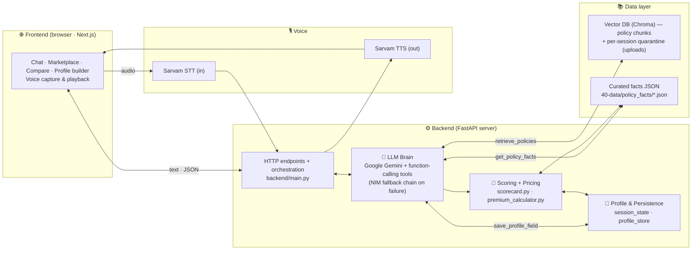

**Reading every diagram in this section.** A consistent legend:

- **Solid arrow (`→`)** = a real call / data flow on the request path.
- **Double arrow (`⇄`)** = bidirectional — one side calls, the other returns.
- **Dotted arrow (`-.->`)** = a side-channel or async event — voice
  playback, barge-in interrupt, end-of-turn persistence, etc. — not on
  the main request path.
- **Subgraph box** = everything inside runs in one place (one process /
  one service / one storage layer).
- Edge labels (e.g. *"retrieve_policies"*) name the actual function or
  signal carried on that edge.

With that, you can read every diagram below without reverse-engineering
its lines.

### 2.3 Single-turn request flow — end to end, all layers

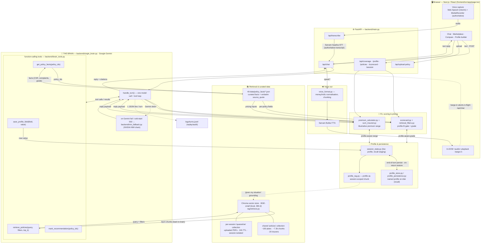

**What this diagram traces.** Everything that happens between a keystroke
(or spoken word) in the browser and a reply (with optional voice playback)
coming back. Drawn across every layer the request crosses.

- **Browser (Next.js / React).** The user types or speaks; the page
  renders chat, marketplace, compare and the profile builder. For voice,
  Web Speech shows a live *interim* transcript while `MediaRecorder`
  captures the *authoritative* audio.
- **FastAPI.** Four endpoint groups: `/api/transcribe` (Sarvam STT),
  `/api/chat` (the brain), `/api/upload-policy` (the 8 security gates →
  quarantine), and the supporting
  `/api/coverage · /profile · /policies · /scorecard · /session`.
- **The brain.** One Gemini call per turn with four function-calling
  tools: `retrieve_policies`, `save_profile_field`, `get_policy_facts`,
  `mark_recommendation`. The brain may *only* state what its tools
  returned.
- **Retrieval (Chroma).** Two arrows now shown explicitly — the brain
  sends a query *out*, and the vector store sends the top-k chunks *back*.
  Shared "policies" collection for the catalogue; per-session
  "quarantine" for uploaded PDFs.
- **Curated facts JSON (`40-data/policy_facts/`).** Two arrows out: the
  brain reads it via `get_policy_facts`, **and** the scoring and pricing
  modules read from it directly (this fixes the earlier
  expert-review gap where only the brain's path was drawn).
- **Scoring + pricing.** `scorecard.py` / `retrieval_filters.py` grade
  each plan for *this* profile (live, not stored); `premium_calculator.py`
  + `sum_insured.py` produce the live illustrative premium range.
- **Profile & persistence.** The brain calls `save_profile_field` which
  writes to `session_state`. End-of-turn, `auto_persist_session` writes
  a `<name>.json` to disk; on a returning user, the same store is read
  back to recognise them. `profile_rag.py` also embeds the profile as a
  session-scoped chunk so the brain can ground "given my situation".
- **Voice out.** `voice_format.py` normalises money / Indic shorthand and
  chunks at sentence bounds; Sarvam Bulbul speaks; an in-DOM `<audio>`
  plays. The user speaking over the bot (barge-in) pauses playback *and*
  aborts the in-flight `/api/chat`.
- **Fallback.** On a real Gemini failure or cold-start 503, the turn
  transparently routes to `nim_fallback.py` — fail-loud, never silently
  wrong. (Detail in §2.4.)
- **Audit.** Every turn appends one JSON line to `logs/turns.jsonl`.

### 2.4 LLM brain + fail-loud fallback chain

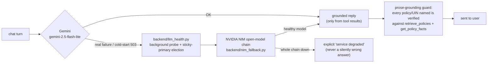

**What this diagram traces.** How a chat turn is served by the primary
LLM, what happens when it fails, and the structural guard that prevents a
silently wrong answer.

- **Primary path.** Gemini (`gemini-2.5-flash-lite`). On a healthy
  response → the reply is built *only* from what the tools returned.
- **Fallback path (fail-loud).** A real Gemini failure or a cold-start
  503 routes through `backend/llm_health.py` (a background probe with
  sticky-primary election) to the NVIDIA NIM open-model chain
  (`nim_fallback.py`). One healthy model in that chain serves the turn.
- **Last resort.** If the whole chain is down, the user gets an explicit
  *"service degraded"* message — never a silently wrong answer.
- **Prose-grounding guard.** Before a reply is sent, every policy / UIN
  named in the prose is verified against the same `retrieve_policies`
  and `get_policy_facts` results the brain saw (with an exemption for
  genuine catalogue UINs). Faithfulness is structural, not bolt-on.


**Why a single brain (not a multi-model pipeline).** Earlier designs split
the work across several LLM passes (a separate fact-find brain, a QA
brain, a faithfulness-judge). That scaffolding was removed: a single
frontier model with well-designed tools is more accurate, far simpler,
and eliminates a whole class of cross-model contract bugs. Today there is
exactly **one** brain call per turn plus its tool calls. Faithfulness is
enforced *structurally* — the brain can only state what `retrieve_policies`
and `get_policy_facts` returned — rather than by a second grader model.

**More on the fallback chain.** The brain's primary is Gemini
(`gemini-2.5-flash-lite`). On a real Gemini failure or a cold-start 503,
the turn falls back to an NVIDIA NIM chain of open models. Candidate
selection uses a background health probe with sticky-primary election
(`backend/llm_health.py`) so one healthy model is chosen per call. The
fallback is **fail-loud**: if the whole chain is down the user gets an
explicit *"service degraded"* message, never a silently wrong answer.
(A separate LLM "judge" existed historically and has been retired — the
single-brain design made it redundant.)

### 2.5 Voice pipeline (in / out, with barge-in)

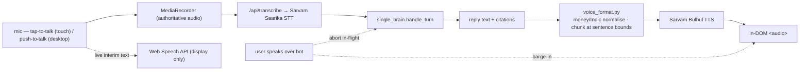

**What this diagram traces.** How spoken input becomes a chat turn, how
the reply becomes speech back, and how the user can interrupt mid-answer.

- **Capture.** Tap-to-talk (touch) or push-to-talk (desktop) starts
  `MediaRecorder` (the authoritative audio) and Web Speech (a live
  interim transcript shown on screen but never trusted for the turn).
- **STT.** The authoritative audio is sent to `/api/transcribe`
  (Sarvam Saarika — Indian-accent + Hinglish aware).
- **Brain → reply.** The transcript runs through `single_brain.handle_turn`
  exactly like a typed turn.
- **TTS.** `voice_format.py` normalises money / Indic shorthand and chunks
  at sentence bounds (so long replies are spoken in full); Sarvam Bulbul
  speaks; an in-DOM `<audio>` element plays.
- **Barge-in.** The user speaking over the bot pauses playback **and**
  aborts the in-flight `/api/chat`, so the bot stops mid-thought rather
  than over-talking.


**More on voice.** The browser shows a live *interim* transcript via the
Web Speech API while `MediaRecorder` captures the **authoritative** audio,
which is sent to `/api/transcribe` (**Sarvam Saarika** STT). Replies are
synthesised by **Sarvam Bulbul** TTS, with money / Indic shorthand
normalised in `backend/voice_format.py` before synthesis (long replies are
chunked at sentence boundaries so the full answer is spoken, not just the
first sentence), and played through an in-DOM `<audio>` element. Speaking
over the bot (**barge-in**) pauses that audio **and** aborts the in-flight
`/api/chat` request. On touch devices voice is tap-to-talk; on desktop,
push-to-talk; the live interim transcript accumulates the full utterance
while you speak.

### 2.6 Profile, personalisation & returning-user recall

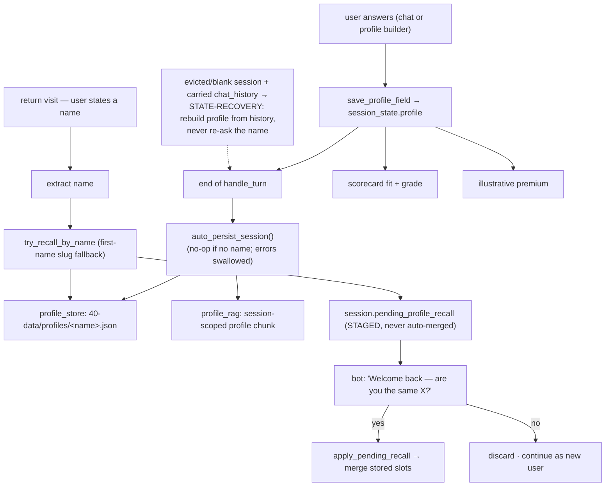

**What this diagram traces.** How the system captures a profile during a
conversation, persists it for the user's next visit, recalls it *safely* on
return, and recovers when the server forgot it.

- **Capture.** Every answer (chat or profile-builder) is persisted via
  `save_profile_field` into the live `session_state.profile`.
- **End-of-turn persist.** `auto_persist_session` writes a
  `<name>.json` to disk **and** embeds the profile as a session-scoped
  chunk — so a returning user can be recognised, and "given my situation"
  references can be grounded.
- **Privacy-safe recall.** On a return visit the captured name is matched
  against the stored profile; a match is **staged** on
  `pending_profile_recall` and the bot asks *"Welcome back — are you the
  same X?"*. Only an explicit *yes* merges the stored slots (so a name
  collision never auto-restores a stranger's profile); *no* discards the
  stage and the user continues fresh.
- **State recovery.** If the server's in-memory session was evicted /
  restarted but the browser still carries `chat_history`, the brain
  enters **STATE-RECOVERY MODE** — silently re-captures the profile from
  the conversation history instead of asking the user's name again.
- **Drives scoring + pricing.** The same profile feeds the scorecard
  fit-and-grade and the live premium estimate.


**More on profile & personalisation.** Your answers build a session
profile (`backend/session_state.py`, `profile_store.py`,
`profile_persistence.py`). The profile is also embedded as a
*session-scoped* chunk (`backend/profile_rag.py`) so the brain can ground
"given my situation" references, with strict per-session isolation. The
*same* profile drives both recommendation fit (scorecard) and the
illustrative premium estimate (`backend/premium_calculator.py`,
`sum_insured.py`) — see §3.2 and §3.3 for what each function actually
computes.

### 2.7 Data architecture & offline ingest pipeline

The previous version of this diagram conflated two different things —
*where data physically lives* (laptop / GitHub / HF Space / HF Dataset)
versus *what kind of data each piece is* (code / vectors / curated JSON).
This version separates them into two readable views.

#### 2.7.1 Where it physically lives

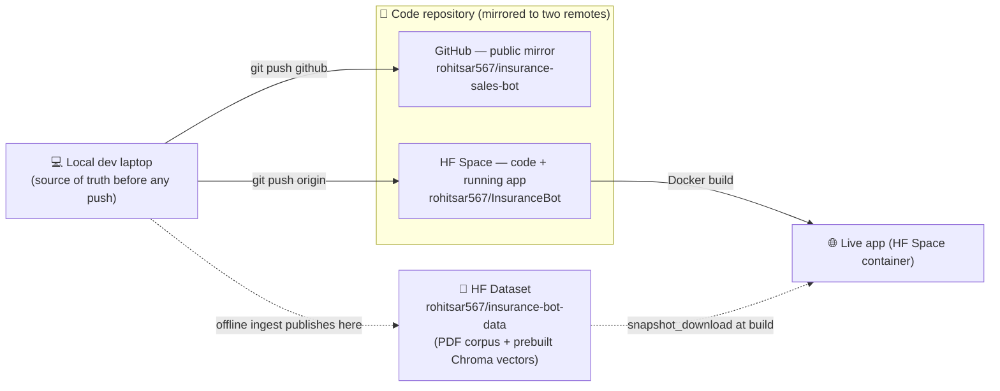

- **Local laptop** is the source of truth before any push.
- **Code repo** lives in **two remotes**: GitHub (a public mirror for
  reviewers) and the HF Space's own repo (`origin`, which is what HF
  rebuilds the running container from on every push).
- **HF dataset** holds the *heavy binaries* (PDF corpus + prebuilt
  vectors) — kept out of the code repo so the deployable image stays
  small. The Space's Docker build pulls it via
  `huggingface_hub.snapshot_download`.

#### 2.7.2 What kind of data lives in each piece

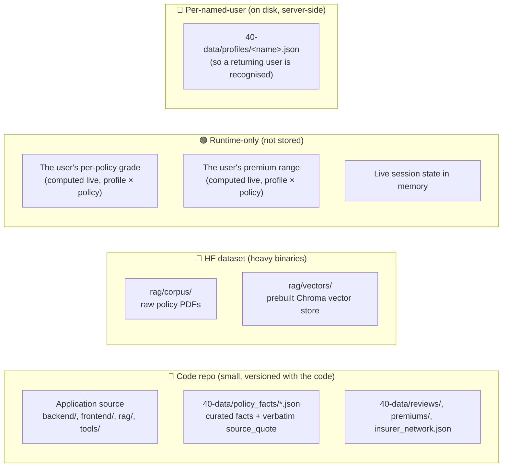

- **Code repo** holds three kinds of files: application source,
  per-policy curated facts JSON (small, decision-critical, human-reviewed
  → versioned with code), and insurer-level reviews / premium baselines /
  network counts.
- **HF dataset** holds the things that are too big to version with code:
  the raw policy PDFs and the prebuilt Chroma vector store.
- **Runtime-only (never stored)** — the *grade* and *premium* for a
  particular policy × particular profile are computed fresh each request.
  Two different users will see two different grades and prices for the
  same policy.
- **Per-named-user** — only the user's *profile* itself is persisted by
  name (so a returning user is recognised). Their grades and prices are
  not.

#### 2.7.3 Offline ingest pipeline (built once, not on the request path)

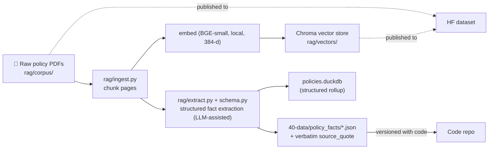

**Why split ingest from extraction.** *Chunking* breaks each PDF into
overlapping text chunks for semantic retrieval. *Extraction* pulls
structured fields (waiting periods, room-rent caps, CSR%, etc.) into a
schema-validated JSON, **with the verbatim source_quote that justifies
each value**. The chunks power free-form Q&A; the JSON powers the
marketplace cards, scoring and pricing.

**Provenance rule:** every policy fact shown to a user traces to a real
clause in a real PDF. Where a document genuinely doesn't state something,
it is recorded as a sourced-null (*"not stated in &lt;file&gt;.pdf"*) —
never invented or back-filled.

### 2.8 Uploaded-PDF defence — 8 sequential gates

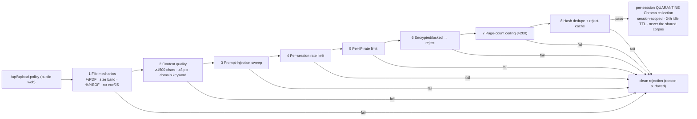

**What this diagram traces.** Every check a user-uploaded PDF passes
before its content is allowed to touch the vector store, and where rejected
files go.

- **The 8 gates, in order.** (1) **File mechanics** — `%PDF` magic, 5 KB–25 MB
  size band, well-formed `%%EOF`, no embedded executables / JavaScript /
  launch actions. (2) **Content quality** — ≥1500 extractable chars,
  ≥3 pages, at least one insurance-domain keyword. (3) **Prompt-injection
  sweep** — "ignore previous instructions", "reveal your system prompt",
  jailbreak patterns. (4) **Per-session rate limit.** (5) **Per-IP rate
  limit** (catches session-ID rotation). (6) **Encrypted/locked PDF** —
  rejected cleanly. (7) **Page-count ceiling** (>200 pages — an
  abuse/bundle vector). (8) **Hash dedupe + reject-cache** — identical
  re-uploads short-circuit.
- **Beyond identical-file dedup.** A **UIN net-new check** also runs — if
  the PDF's IRDAI UIN already belongs to a catalogued policy, the caller
  is pointed at the existing marketplace card instead of indexing a
  duplicate.
- **On pass.** Chunks land in a per-session **quarantine** Chroma
  collection — session-isolated, 24 h idle TTL — *never* the shared
  `policies` corpus.
- **On fail.** A clean rejection naming the gate; the file is deleted;
  nothing is embedded.


### 2.9 Deployment

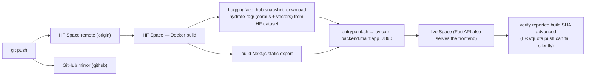

**What this diagram traces.** How a `git push` becomes a live Space, end
to end.

- **Two remotes.** `origin` = the Hugging Face Space (a push here
  triggers the Docker rebuild). `github` = the public mirror reviewers
  read.
- **Build.** The HF Space rebuilds the image, installs the backend,
  builds the Next.js static frontend, and runs
  `huggingface_hub.snapshot_download` to hydrate `rag/` (PDF corpus +
  prebuilt vectors) from the `insurance-bot-data` dataset — so the Space
  repo itself stays code-only and small.
- **Start.** `entrypoint.sh` launches `uvicorn backend.main:app` on
  `$PORT` (default 7860); FastAPI also serves the exported frontend.
- **Verify.** Always confirm the Space's reported build SHA actually
  advanced before trusting that new code is live — an LFS/quota push
  can fail without surfacing an error.


---

## 3. Key functions in plain language

**The short answer.** The bot has six internal "jobs". Each one is
defined by its inputs, what it does, and what it returns — in plain
language. A seventh subsection makes explicit *what is stored vs what is
live-only*, because that's the question reviewers most often miss.

### 3.1 Profile construction
- **Job.** Turn the user's conversation (or profile-builder answers) into
  a structured profile object.
- **Inputs.** Raw text from `/api/chat` or `/api/profile`.
- **How.** The LLM brain calls `save_profile_field(field, value)` once
  per fact captured (name, age, dependants, location_tier, income_band,
  primary_goal, health_conditions, family_medical_history, smoker,
  desired_sum_insured_inr, budget_band, existing_cover_inr, copay_pct,
  parents_age_max).
- **Output.** The live `session.profile`.
- **Persistence.** In memory during the session, **and** persisted to
  disk as `40-data/profiles/<name>.json` at end of turn (so a returning
  user can be recognised next visit — see §3.6).

### 3.2 Profile-aware scoring (per-policy grade)
- **Job.** Grade every policy *for this user*, so the shortlist is
  ranked by fit and a single A–E letter grade is shown on every card.
- **Inputs.** The live profile + the policy's curated facts
  (`40-data/policy_facts/<policy>.json`) + insurer-level review data.
- **How.** `backend/scorecard.py :: build_scorecard(policy, insurer_reviews, profile)`
  computes six sub-scores (coverage, predictability, claims, network,
  renewal, terms), assembles a letter grade, and produces a
  **profile-personalised summary** (top strengths for *this* user + the
  one honest caveat that caps the grade).
- **Output.** The grade, six sub-scores, and the summary shown on the
  marketplace card and in the in-chat policy card.
- **Storage.** Computed live per request — **not stored**. Two different
  users get two different grades for the *same* policy because the
  weighting and the summary are profile-aware.

### 3.3 Profile-aware pricing (illustrative premium)
- **Job.** Show a ballpark premium range for a policy *for this user*.
- **Inputs.** The profile (age, family size, location, smoker, deductible,
  co-pay, sum insured) + the policy's pricing characteristics.
- **How.** `backend/premium_calculator.py :: estimate` runs a
  **multivariate regression-style ballpark** over public rate-card
  combinations — age band × metro/non-metro × smoker / non-smoker × PED
  / no-PED × chosen co-pay / chosen deductible / chosen sum insured.
- **Output.** A range like *"₹12,500 – ₹17,200 / yr, point ≈ ₹14,800"*
  with a clear illustrative-only disclaimer.
- **Honest caveat.** This is **not** real underwriting. It's a
  directional ballpark from public rate cards. The final premium depends
  on the insurer's underwriting + your medicals + IRDAI-filed loadings.
- **Storage.** Computed live per request — **not stored**.

### 3.4 Retrieval (over the policy corpus)
- **Job.** When the brain needs to *cite* a policy fact, fetch the actual
  clause from the actual PDF.
- **Inputs.** A search query the brain composes from the profile + the
  user's question.
- **How.** `retrieve_policies(query, filters, top_k)` embeds the query
  with **BGE-small** (local, 384-d) and looks up the Chroma vector store
  of pre-chunked policy PDFs (~150 plans, ~7.3 k chunks, 20 insurers).
  The **shared** "policies" collection serves all users; a **per-session
  "quarantine"** collection holds uploaded PDFs (isolated, 24 h TTL).
- **Output.** The top-k matching chunks with their source PDF, page, and
  policy_id.
- **Faithfulness.** The brain may *only* state what these chunks (or
  `get_policy_facts`) returned — see §2.4.

### 3.5 Policy-facts lookup (numbers without retrieval)
- **Job.** Answer questions about *already-curated* policy fields —
  claim-settlement ratio, complaints volume, the scorecard, room-rent
  rules, waiting periods, etc. — without doing free-form retrieval.
- **Inputs.** One or more `policy_id`s.
- **How.** `get_policy_facts(policy_ids)` reads
  `40-data/policy_facts/<id>.json` directly.
- **Output.** Structured fields (CSR%, ICR%, complaints/10k, grade) the
  brain cites in its answer.
- **Why both this and §3.4 exist.** The vector store is for free-form
  Q&A over policy wording. The curated JSON is for fast, exact, source-
  cited lookups of decision-critical numbers without an embedding hop.

### 3.6 Returning-user recall
- **Job.** Recognise a returning user safely and offer to restore their
  saved profile.
- **How.** When the captured name matches a stored
  `40-data/profiles/<name>.json`, the match is **staged** on
  `pending_profile_recall` (never auto-merged) and the bot asks
  *"Welcome back — are you the same X?"*. An explicit *yes* merges the
  stored slots; an explicit *no* discards the stage and the user
  continues as a brand-new visitor.
- **Why staged + confirm.** A bare name is a weak, shared key.
  Auto-restoring would silently leak a stranger's profile if names
  collide. The confirm gate prevents that.
- **Bonus — state recovery.** If the server's in-memory session was
  evicted / restarted but the browser still carries `chat_history`, the
  brain enters **STATE-RECOVERY MODE** — it silently re-captures the
  profile from the conversation history rather than asking the user's
  name again. The user never perceives a loss.

### 3.7 What is stored vs what is live-only

| What | Where | Why |
| --- | --- | --- |
| Policy PDFs + their vector chunks | `rag/corpus/`, Chroma store — both pulled from the HF dataset at Docker build | Built once, offline; read every request |
| Curated policy facts (per policy) | `40-data/policy_facts/*.json` (in the code repo) | Small, human-reviewed, versioned with code |
| The user's saved profile (by name) | `40-data/profiles/<name>.json` (server-side, per-named-user) | So a returning user can be recognised |
| The user's per-policy **grade / scorecard** | **Not stored — live per request** | Two users get two grades for the same policy (profile-aware) |
| The user's **premium range** for a policy | **Not stored — live per request** | Same reason as the grade |
| Uploaded PDFs | Per-session Chroma quarantine, **24 h TTL** | Isolated to the uploader, never the shared corpus |
| The reasoning the brain showed this turn | `logs/turns.jsonl` (one JSON line per turn) | Replay / audit; never echoed back to other users |

---

## 4. Data architecture

There are **three repositories**, deliberately separated:

*(You don't need any of this to use the app — just open the live link at
the top. This section is for someone running or reviewing the code.)*

The data is split into **three places**, each for a clear reason:

| # | Place | What it holds | Why it's separate |
| - | --- | --- | --- |
| 1 | **Code repo** (this repo — HF Space + GitHub mirror) | Application source only — no data blobs | Keeps the deployable image small (the Space has a tight size cap) |
| 2 | **Data dataset** (HF dataset `rohitsar567/insurance-bot-data`) | The big binaries: policy-PDF corpus + prebuilt Chroma vectors | Large files don't belong in code; pulled in automatically at build |
| 3 | **Curated facts** (`40-data/`, inside this code repo) | Small, human-reviewed JSON the backend reads on every request | Decision-critical and tiny — safe to version alongside the code |

What lives where:

- **`rag/corpus/`** — raw policy PDFs. Git-ignored; hydrated at Docker build
  from the data dataset via `huggingface_hub.snapshot_download`.
- **`rag/vectors/`** — persisted Chroma store (BGE-small-en-v1.5, local CPU,
  384-d). Git-ignored; from the data dataset.
- **`40-data/policy_facts/*.json`** — per-policy curated facts, each value
  carrying its verbatim `source_quote`. Powers the marketplace cards and
  scorecards.
- **`40-data/reviews/`, `premiums/`, `insurer_network.json`** — sourced
  insurer reviews, illustrative premium baselines, hospital-network counts.
- **`rag/ingest.py` / `extract.py` / `schema.py` / `policies.duckdb`** — the
  *offline* ingestion + structured-extraction pipeline (download → chunk →
  embed → extract). Not on the request hot path; used to (re)build the data
  dataset.

**Provenance rule:** every policy fact shown to a user traces to a real clause
in a real PDF. Where a document genuinely doesn't state something, it is
recorded as an honest sourced-null ("not stated in `<file>.pdf`"), never
invented or back-filled.

---

## 4. Safety & quality

### 4.1 Uploaded-PDF defence (8 gates)

`/api/upload-policy` accepts arbitrary PDFs from the public web — a real
attack surface. `backend/security.py` runs every upload through eight gates
before the file is ever embedded or shown to the model:

1. **File mechanics** — `%PDF` magic, 5 KB–25 MB size band, well-formed
   `%%EOF`, and a scan for embedded executables / JavaScript / launch actions.
2. **Content quality** — ≥1500 chars of extractable text, ≥3 pages, and at
   least one insurance-domain keyword (rejects scans, junk, off-topic docs).
3. **Prompt-injection** — regex sweep for "ignore previous instructions",
   "reveal your system prompt", jailbreak patterns, etc.
4. **Per-session rate limit** — caps uploads / chunk quota per session.
5. **Per-IP rate limit** — catches session-ID rotation.
6. **Encrypted/locked PDF** — rejected cleanly rather than stored opaque.
7. **Page-count ceiling** — >200 pages is an abuse/bundle vector.
8. **Hash dedupe + reject-cache** — identical re-uploads short-circuit.

Beyond identical-file dedup, a **UIN net-new check** runs on every upload:
if the PDF's IRDAI UIN already belongs to a catalogued policy, the upload
is recognised as *not* net-new and the caller is pointed at the existing
marketplace card instead of a duplicate being indexed.

Accepted uploads are embedded into a **separate, per-session quarantine**
Chroma collection (never the shared corpus), scoped by `session_id` so one
user's document is invisible to another, and auto-purged after a 24-hour idle
TTL.

### 4.2 Answer faithfulness

Faithfulness is structural, not bolt-on: the brain answers only from what
its tools returned — `retrieve_policies` (policy-wording chunks) and
`get_policy_facts` (claim-settlement ratio, complaints, scorecard and
insurer-review data) — must cite, and is instructed to refuse when that
grounding is weak. A prose-grounding guard verifies any policy / UIN named
in the reply against both tools' returned policies before it is sent.
Recommendation fit is gated (`backend/scorecard.py`,
`retrieval_filters.py`) so plans that structurally don't fit the user's stated
constraints are dropped, with the reason surfaced.

### 4.3 Evaluation

A gold Q&A harness lives at `eval/run.py`. **Status:** it is pending a re-port
to the single-brain architecture (it targeted the removed orchestrator) and is
intentionally hard-guarded from running so it cannot publish stale scores; see
its module docstring. The automated test suite (`tests/`, run with `pytest`)
is the current green gate and covers routing, scoring, premium, recall, the
upload security gates, and conversation logic.

### 4.4 Known limitations (honest)

These are real and stated up front rather than buried:

- **Uploaded-doc persistence is within-session, not across restarts.**
  Upload → graded marketplace card → grounded Q&A about the PDF all work
  live within a running container. But the Hugging Face Space's working
  filesystem is ephemeral by design (a fresh Chroma snapshot is pulled on
  every rebuild — see §4), and in practice an uploaded doc does **not**
  survive a Space rebuild/restart: the marketplace reverts to its
  curated/extracted baseline. Treat uploads as session-scoped. An
  operator/abuse prune endpoint exists (`POST /api/admin/uploaded-docs/
  prune`, password-gated) to remove a persisted upload by id or prefix.
- **Uploaded-PDF field extraction is deterministic-heuristic, not LLM.**
  A standard IRDAI-format wording yields a real (non-sentinel) grade; a
  scanned-image or non-standard PDF with little extractable text honestly
  shows the data-starved sentinel rather than a fabricated grade.
- **Live (BETA) voice mode** uses the browser's in-built speech
  recognition and is labelled unstable; **push-to-talk** is the reliable
  path (warm-armed mic + pre-roll so the first word is never clipped, and
  long answers are chunked so nothing is truncated).
- **Recommendation vs. factual lookup.** A factual question that names a
  specific policy is answerable on a cold session; broad "recommend me a
  plan" requests still require the short fact-find first (by design).

---

## 4. Tech stack & key decisions

| Layer | Choice | One-line why |
| --- | --- | --- |
| Frontend | Next.js 16 (App Router), React 19, Tailwind v4, static export | Production-pattern UI; static export serves straight from the Space |
| Backend | FastAPI + Pydantic | Async I/O, typed request/response, auto OpenAPI |
| Brain | Google Gemini (`gemini-2.5-flash-lite`) + function calling | Frontier free-tier quality; one model + tools beats a multi-pass pipeline |
| Fallback | NVIDIA NIM open-model chain, health-elected | Free, diverse; fail-loud, never silently wrong |
| Retrieval | Chroma + BGE-small-en-v1.5 (local, 384-d) | Embedded, no infra, free, offline embeddings |
| Voice | Sarvam Saarika (STT) + Bulbul (TTS) + Sarvam-M (Indic) | First-class Indian-accent / Hinglish handling |
| Hosting | Hugging Face Space (Docker) + companion HF dataset | Free, GitHub-mirrored; code/data split keeps the image small |

Decisions are deliberately biased toward *one deployable artifact, no
fabrication, fail loud*. The single-brain consolidation, the NIM-only fallback
(structured-output reliability over cross-provider breadth), the local
embeddings (zero rate limits, offline ingest) and the code/data repo split are
the load-bearing ones.

---

## 4. Repository map

**At a glance** — the root is intentionally small; you only need to know
these:

- **`backend/`** — FastAPI app + the brain, tools, retrieval, scoring, security
- **`frontend/`** — the Next.js web app
- **`rag/`** — retrieval + offline ingest (corpus/vectors are git-ignored, pulled at build)
- **`40-data/`** — curated, human-reviewed policy facts (versioned with code)
- **`tests/`** — the pytest green gate
- root files: `Dockerfile`, `entrypoint.sh`, `requirements.txt`, `pytest.ini`, `README.md`

<details>
<summary><b>Full directory tree</b> — click to expand</summary>

```
.
├── backend/                  FastAPI app
│   ├── main.py               HTTP routes (chat, transcribe, upload, profile, …)
│   ├── single_brain.py       THE brain — Gemini + function-calling tools
│   ├── brain_tools.py        the tools the brain can call (retrieval, profile, …)
│   ├── nim_fallback.py       NIM fallback when Gemini fails / cold-start 503
│   ├── llm_health.py         background probe + sticky-primary election
│   ├── security.py           the 8 upload-defence gates
│   ├── scorecard.py /        recommendation fit + scoring
│   │   retrieval_filters.py
│   ├── premium_calculator.py profile → illustrative premium
│   │   sum_insured.py
│   ├── session_state.py /    per-session profile + persistence
│   │   profile_store.py / profile_persistence.py / profile_rag.py
│   ├── voice_format.py       TTS pre-processing (money/Indic normalisation)
│   ├── admin.py              /api/admin/* (health, telemetry)
│   └── providers/            thin clients: google_gemini, nvidia_nim, sarvam_*,
│                             local_embeddings (BGE), openrouter/groq (dormant)
├── frontend/                 Next.js 16 app (src/app/page.tsx, src/lib/*)
├── rag/                      retrieval + offline ingest pipeline
│   ├── retrieve.py           query → top-k chunks (request hot path)
│   ├── ingest.py/extract.py/schema.py   offline corpus build
│   ├── corpus/ vectors/      data — git-ignored, from the HF dataset
│   └── policies.duckdb       offline structured rollup
├── 40-data/                  curated, version-with-code structured facts
│   ├── policy_facts/*.json   per-policy facts + verbatim source_quote
│   └── reviews/ premiums/ insurer_network.json
├── eval/                     gold Q&A harness (pending single-brain re-port)
├── 70-docs/                  design docs & ADRs  ⚠️ see note below
├── 80-audit/                 defect register / audit transcripts
├── tools/                    operational scripts (corpus, probes, link-rot)
├── tests/                    pytest suite — the green gate (`pytest`)
├── Dockerfile / entrypoint.sh   HF Space image (pulls the data dataset)
├── pytest.ini                scopes pytest to tests/ (clean on a fresh clone)
└── requirements.txt
```

</details>

> ⚠️ **Note on `70-docs/` and ADRs:** these capture design history and
> rationale; some predate the single-brain rewrite and are being brought into
> line with the system as it actually runs today. **This README is the
> authoritative present-state map**; the ADRs are decision context.

---

## 4. Run it locally

**Prerequisites:** Python 3.11+, Node 20+, the API keys below.

```bash
# 1. Code
git clone <code-repo-url> "Insurance Sales Bot"
cd "Insurance Sales Bot"
python -m venv .venv && . .venv/bin/activate
pip install -r requirements.txt

# 2. Data (corpus + prebuilt vectors live in the companion dataset)
python -c "from huggingface_hub import snapshot_download; \
  snapshot_download(repo_id='rohitsar567/insurance-bot-data', \
  repo_type='dataset', local_dir='rag/_hf_dataset_backup')"
#   then place rag/corpus and rag/vectors from the snapshot into rag/
#   (the Docker build does this automatically; see entrypoint.sh)

# 3. Secrets — copy the example and fill in:
cp .env.example .env
#   GOOGLE_API_KEY      — Gemini brain (primary)         [required]
#   NVIDIA_NIM_API_KEY  — NIM fallback chain             [required]
#   SARVAM_API_KEY      — STT / TTS / Indic              [required for voice]
#   HF_TOKEN            — pull the data dataset at boot  [required]
#   ADMIN_PASSWORD      — gates /api/admin/*             [required]
#   VOYAGE_API_KEY      — offline ingest embeddings only [ingest only]
#   OPENROUTER/GROQ_API_KEY — dormant (kept for one-flip re-enable)

# 4. Backend
uvicorn backend.main:app --host 127.0.0.1 --port 8000 --reload

# 5. Frontend (separate terminal)
cd frontend && npm install && npm run dev      # http://localhost:3000

# Tests (the green gate)
pytest                                          # collects tests/ only
```

---

## 4. Deployment

Hosting is a **Hugging Face Space** running the `Dockerfile`:

1. The image installs the backend and builds the static frontend.
2. At build time it runs `huggingface_hub.snapshot_download` to hydrate
   `rag/` (corpus + vectors) from the `rohitsar567/insurance-bot-data`
   dataset, so the Space repo itself stays code-only and small.
3. `entrypoint.sh` starts `uvicorn backend.main:app` on `$PORT` (default
   `7860`, the port HF Spaces routes to); FastAPI also serves the exported
   frontend.

The code repo is mirrored to **both** the HF Space remote (`origin`) and a
GitHub remote (`github`); the heavy data is updated on the HF **dataset**
side. Space repository secrets supply the API keys listed in §4. After any
deploy, verify the Space's reported build SHA actually advanced before
trusting that new code is live (a quota/LFS push can fail without surfacing
an error).
